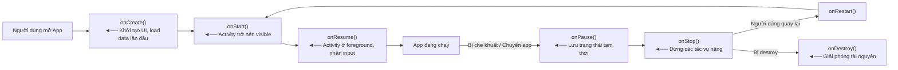

# 📱 Android Apps – PHÁT TRIỂN ỨNG DỤNG TRÊN THIẾT BỊ DI ĐỘNG - TEE0419

> **Sinh viên:** Nguyễn Như Khiêm 
> **MSSV:** [Mã số sinh viên]  
> **Môn học:** PHÁT TRIỂN ỨNG DỤNG TRÊN THIẾT BỊ DI ĐỘNG - TEE0419

---

## 📑 Mục Lục

- [Tổng Quan](#tổng-quan)
- [Kiến Thức Nền Tảng Android](#kiến-thức-nền-tảng-android)
  - [AndroidManifest.xml](#1-androidmanifestxml)
  - [Vòng Đời Ứng Dụng Android](#2-vòng-đời-ứng-dụng-android)
  - [Kiểm Tra Quyền Runtime](#3-kiểm-tra-quyền-runtime-java)
  - [Giao Diện XML Layout](#4-giao-diện-reslayout--xml)
  - [Tránh Hardcode – Dùng Resources](#5-tránh-hardcode--dùng-resources)
  - [ViewGroup – Layout Container](#6-viewgroup--layout-container)
  - [Tương Tác Layout từ Code Java](#7-tương-tác-layout-từ-code-java)
  - [Xử Lý Sự Kiện – Event Handling](#8-xử-lý-sự-kiện--event-handling)
  - [Thư Mục Assets](#9-thư-mục-assets)
- [App 1 – Ẩm Thực Việt Nam](#app-1--ẩm-thực-việt-nam)
- [App 2 – Giải Toán & API](#app-2--giải-toán--api)
- [Hướng Dẫn Cài Đặt & Chạy](#hướng-dẫn-cài-đặt--chạy)
- [Cấu Trúc Repository](#cấu-trúc-repository)

---

## Tổng Quan

| | App 1 | App 2 |
|---|---|---|
| **Tên** | Ẩm Thực Việt Nam | Giải Toán & API |
| **Mục tiêu** | Giới thiệu món ăn 3 miền | 3 Activity, gọi API, WebView |
| **Kỹ thuật chính** | Assets, JSON, RecyclerView | Intent, OkHttp, WebView |
| **Ngôn ngữ** | Java | Java |
| **Min SDK** | API 24 (Android 7.0) | API 24 (Android 7.0) |

---

## Kiến Thức Nền Tảng Android

### 1. AndroidManifest.xml

**Mô tả:** Đây là file khai báo trung tâm của mọi ứng dụng Android. Hệ điều hành đọc file này trước khi chạy app để biết:

| Nội dung khai báo | Ý nghĩa |
|---|---|
| Package name | Định danh duy nhất của app trên thiết bị & Play Store |
| Các Activity, Service, Receiver | Những thành phần nào tồn tại trong app |
| Quyền (Permissions) | App cần truy cập những tài nguyên hệ thống nào |
| Intent Filter | Activity nào là màn hình khởi động (`MAIN + LAUNCHER`) |
| Min/Target SDK | App chạy được trên Android phiên bản nào |

**Khai báo quyền (Permissions):**

```xml
<!-- AndroidManifest.xml -->
<manifest xmlns:android="http://schemas.android.com/apk/res/android"
    package="com.example.myapp">

    <!-- Quyền truy cập Internet -->
    <uses-permission android:name="android.permission.INTERNET" />

    <!-- Quyền đọc bộ nhớ ngoài -->
    <uses-permission android:name="android.permission.READ_EXTERNAL_STORAGE" />

    <!-- Quyền truy cập Camera -->
    <uses-permission android:name="android.permission.CAMERA" />

    <!-- Quyền truy cập vị trí -->
    <uses-permission android:name="android.permission.ACCESS_FINE_LOCATION" />

    <application
        android:allowBackup="true"
        android:icon="@mipmap/ic_launcher"
        android:label="@string/app_name"
        android:theme="@style/Theme.MyApp">

        <activity
            android:name=".MainActivity"
            android:exported="true">
            <intent-filter>
                <!-- Đây là Activity khởi động đầu tiên -->
                <action android:name="android.intent.action.MAIN" />
                <category android:name="android.intent.category.LAUNCHER" />
            </intent-filter>
        </activity>

        <activity android:name=".SecondActivity" android:exported="false"/>

    </application>
</manifest>
```

> 💡 **Tại sao phải khai báo?**  
> Android theo mô hình bảo mật "sandbox" – mỗi app chỉ có quyền truy cập những gì đã được người dùng cho phép. Khai báo trong Manifest là bước 1; với Android 6.0+ còn cần xin quyền tại runtime (xem mục 3).

---

### 2. Vòng Đời Ứng Dụng Android

**Vòng đời Activity (Activity Lifecycle):**


**Tại sao Android Studio tự sinh sẵn `onCreate()`?**

```java
public class MainActivity extends AppCompatActivity {

    @Override
    protected void onCreate(Bundle savedInstanceState) {
        super.onCreate(savedInstanceState);
        setContentView(R.layout.activity_main); // Gắn file XML layout vào Activity
        
        // ► Đây là nơi bạn viết code khởi tạo:
        //   - Tìm các View (findViewById)
        //   - Gắn listener cho button
        //   - Load dữ liệu ban đầu
    }
}
```

> 💡 **Lý do:** `onCreate()` là callback **đầu tiên và bắt buộc** trong vòng đời – nó chỉ được gọi **1 lần duy nhất** khi Activity được tạo. Đây là thời điểm phù hợp nhất để khởi tạo UI và dữ liệu ban đầu. Android Studio sinh sẵn để lập trình viên không bỏ sót bước quan trọng này.

---

### 3. Kiểm Tra Quyền Runtime (Java)

Từ Android 6.0 (API 23), các quyền "nguy hiểm" (camera, vị trí, storage...) phải được **xin tại runtime**, không chỉ khai báo trong Manifest.

```java
import androidx.core.app.ActivityCompat;
import androidx.core.content.ContextCompat;
import android.Manifest;
import android.content.pm.PackageManager;

public class MainActivity extends AppCompatActivity {

    private static final int REQUEST_CODE_CAMERA = 100;

    @Override
    protected void onCreate(Bundle savedInstanceState) {
        super.onCreate(savedInstanceState);
        setContentView(R.layout.activity_main);

        checkAndRequestCameraPermission();
    }

    // Bước 1: Kiểm tra xem app đã có quyền chưa
    private void checkAndRequestCameraPermission() {
        if (ContextCompat.checkSelfPermission(this, Manifest.permission.CAMERA)
                == PackageManager.PERMISSION_GRANTED) {
            // ✅ Đã có quyền → thực hiện tác vụ
            openCamera();
        } else {
            // ❌ Chưa có quyền → xin quyền từ người dùng
            ActivityCompat.requestPermissions(
                this,
                new String[]{Manifest.permission.CAMERA},
                REQUEST_CODE_CAMERA
            );
        }
    }

    // Bước 2: Nhận kết quả người dùng chọn Allow / Deny
    @Override
    public void onRequestPermissionsResult(int requestCode,
            String[] permissions, int[] grantResults) {
        super.onRequestPermissionsResult(requestCode, permissions, grantResults);
        
        if (requestCode == REQUEST_CODE_CAMERA) {
            if (grantResults.length > 0
                    && grantResults[0] == PackageManager.PERMISSION_GRANTED) {
                // ✅ Người dùng cho phép
                openCamera();
            } else {
                // ❌ Người dùng từ chối
                Toast.makeText(this, "Cần quyền camera để sử dụng tính năng này",
                    Toast.LENGTH_SHORT).show();
            }
        }
    }

    private void openCamera() {
        // Logic mở camera ở đây
    }
}
```

> **Ý nghĩa:**  
> - `checkSelfPermission()` → trả về `PERMISSION_GRANTED` hoặc `PERMISSION_DENIED`  
> - `requestPermissions()` → hiển thị dialog hệ thống xin quyền  
> - `onRequestPermissionsResult()` → callback nhận kết quả người dùng chọn  

---

### 4. Giao Diện `res/layout` – XML

Giao diện Android được mô tả bằng file XML trong thư mục `res/layout/`. Android Studio cung cấp **UI Design Editor** để kéo thả trực quan, đồng thời sinh ra XML tương ứng.

```xml
<!-- res/layout/activity_main.xml -->
<?xml version="1.0" encoding="utf-8"?>
<LinearLayout
    xmlns:android="http://schemas.android.com/apk/res/android"
    android:layout_width="match_parent"
    android:layout_height="match_parent"
    android:orientation="vertical"
    android:padding="16dp">

    <TextView
        android:id="@+id/tvTitle"
        android:layout_width="match_parent"
        android:layout_height="wrap_content"
        android:text="@string/app_title"
        android:textSize="@dimen/title_size"
        android:textColor="@color/primary" />

    <Button
        android:id="@+id/btnClick"
        android:layout_width="wrap_content"
        android:layout_height="wrap_content"
        android:text="@string/btn_label"
        android:onClick="onButtonClick" />

</LinearLayout>
```

**Giải thích các thuộc tính quan trọng:**

| Thuộc tính | Giá trị | Ý nghĩa |
|---|---|---|
| `layout_width` | `match_parent` | Chiều rộng = parent |
| `layout_width` | `wrap_content` | Chiều rộng vừa đủ nội dung |
| `id` | `@+id/tvTitle` | Đặt ID để tìm từ Java |
| `text` | `@string/app_title` | Tham chiếu tới strings.xml |
| `orientation` | `vertical` / `horizontal` | Hướng sắp xếp con |

---

### 5. Tránh Hardcode – Dùng Resources

#### ❌ Cách SAI (hardcode trực tiếp):
```xml
<TextView android:text="Xin chào" android:textColor="#FF0000" android:textSize="18sp"/>
```

#### ✅ Cách ĐÚNG (dùng tham chiếu):
```xml
<TextView 
    android:text="@string/greeting"
    android:textColor="@color/primary"
    android:textSize="@dimen/body_text_size"/>
```

**Khai báo các giá trị trong file resource:**

```xml
<!-- res/values/strings.xml -->
<resources>
    <string name="app_name">Ẩm Thực Việt Nam</string>
    <string name="greeting">Xin chào!</string>
    <string name="btn_label">Khám phá</string>
</resources>

<!-- res/values/colors.xml -->
<resources>
    <color name="primary">#E53935</color>
    <color name="background">#FFFFFF</color>
</resources>

<!-- res/values/dimens.xml -->
<resources>
    <dimen name="title_size">22sp</dimen>
    <dimen name="body_text_size">16sp</dimen>
</resources>
```

**Cú pháp tham chiếu:**

| Loại resource | Trong XML | Trong Java |
|---|---|---|
| String | `@string/tên` | `getString(R.string.tên)` |
| Color | `@color/tên` | `getColor(R.color.tên)` |
| Dimen | `@dimen/tên` | `getResources().getDimension(R.dimen.tên)` |
| Drawable | `@drawable/tên` | `getDrawable(R.drawable.tên)` |

#### Ưu điểm của việc dùng tham chiếu:

| Ưu điểm | Giải thích |
|---|---|
| **Đa ngôn ngữ (i18n)** | Tạo `res/values-vi/strings.xml`, `res/values-en/strings.xml` – OS tự chọn theo ngôn ngữ thiết bị |
| **Đa theme** | Tạo `res/values-night/colors.xml` – OS tự chọn Dark/Light mode |
| **Đa vùng (Locale)** | Tạo `res/values-vi-rVN/` – định dạng ngày, tiền tệ tự động |
| **Dễ bảo trì** | Thay đổi 1 nơi, áp dụng toàn app |
| **Tránh lỗi nhất quán** | Không có chỗ dùng màu #FF0000, chỗ dùng #ff0000 |

#### Cơ chế Auto theo LOCATION / LANGUAGE / THEME:

```
res/
├── values/                  ← mặc định (tiếng Anh, Light mode)
│   ├── strings.xml
│   └── colors.xml
├── values-vi/               ← Tự động dùng khi thiết bị đặt tiếng Việt
│   └── strings.xml
├── values-night/            ← Tự động dùng khi Dark Mode
│   └── colors.xml
├── values-en-rUS/           ← Tự động dùng khi locale = US English
│   └── strings.xml
└── values-vi-rVN/           ← Tự động dùng khi locale = Vietnamese (VN)
    └── strings.xml
```

> 💡 App tự động hỗ trợ **đa ngôn ngữ, dark mode, và bản địa hoá** mà không cần viết thêm code logic – chỉ cần tạo đúng thư mục resource!

---

### 6. ViewGroup – Layout Container

**ViewGroup** là đối tượng chứa, gộp các View con lại theo một quy luật sắp xếp nhất định.

#### LinearLayout – sắp xếp tuần tự

```xml
<!-- Sắp xếp các con theo chiều DỌC -->
<LinearLayout
    android:layout_width="match_parent"
    android:layout_height="wrap_content"
    android:orientation="vertical"
    android:gravity="center_horizontal">

    <TextView android:text="@string/item1" .../>
    <TextView android:text="@string/item2" .../>
    <Button   android:text="@string/btn"   .../>

</LinearLayout>

<!-- Sắp xếp các con theo chiều NGANG -->
<LinearLayout
    android:orientation="horizontal"
    android:gravity="center_vertical"
    ...>

    <ImageView .../>
    <TextView  .../>

</LinearLayout>
```

**Thuộc tính `gravity` vs `layout_gravity`:**

| Thuộc tính | Ý nghĩa |
|---|---|
| `android:gravity` | Căn chỉnh **nội dung bên trong** View/ViewGroup |
| `android:layout_gravity` | Căn chỉnh **bản thân View** trong ViewGroup cha |

```xml
<!-- gravity các giá trị phổ biến -->
android:gravity="center"             <!-- giữa cả 2 chiều -->
android:gravity="center_horizontal"  <!-- giữa theo chiều ngang -->
android:gravity="center_vertical"    <!-- giữa theo chiều dọc -->
android:gravity="start"              <!-- trái (RTL-aware) -->
android:gravity="end"                <!-- phải (RTL-aware) -->
android:gravity="top|start"          <!-- trái trên (kết hợp bằng |) -->
```

#### Các ViewGroup phổ biến khác:

| ViewGroup | Đặc điểm |
|---|---|
| `ConstraintLayout` | Định vị bằng ràng buộc, linh hoạt nhất, khuyên dùng |
| `RelativeLayout` | Định vị tương đối so với nhau |
| `FrameLayout` | Chồng lên nhau (overlay) |
| `RecyclerView` | Danh sách cuộn tối ưu hiệu năng |

---

### 7. Tương Tác Layout từ Code Java

#### Lấy reference tới View và hiển thị text:

```java
public class MainActivity extends AppCompatActivity {

    private TextView tvGreeting;
    private Button btnAction;

    @Override
    protected void onCreate(Bundle savedInstanceState) {
        super.onCreate(savedInstanceState);
        setContentView(R.layout.activity_main);

        // Tìm View theo ID đã khai báo trong XML
        tvGreeting = findViewById(R.id.tvGreeting);
        btnAction  = findViewById(R.id.btnAction);

        // ❌ Cách SAI: hardcode text
        // tvGreeting.setText("Xin chào");

        // ✅ Cách ĐÚNG: lấy string từ resources
        // → Tự động theo ngôn ngữ/theme của thiết bị
        tvGreeting.setText(getString(R.string.greeting));

        // Hiển thị string có tham số (placeholder)
        // strings.xml: <string name="welcome">Chào, %1$s!</string>
        String name = "An";
        tvGreeting.setText(getString(R.string.welcome, name));
    }
}
```

> **Tại sao dùng `getString(R.string.xxx)` thay vì hardcode?**  
> Khi thiết bị đổi ngôn ngữ sang tiếng Anh, `R.string.greeting` tự động trả về giá trị từ `values-en/strings.xml`. Nếu hardcode `"Xin chào"` thì không bao giờ đổi được.

---

### 8. Xử Lý Sự Kiện – Event Handling

#### Layout cần làm gì?

Gán `android:id` cho View để Java tìm được, hoặc dùng `android:onClick` trực tiếp.

```xml
<!-- Cách 1: Dùng android:onClick trong XML -->
<Button
    android:id="@+id/btnSubmit"
    android:layout_width="wrap_content"
    android:layout_height="wrap_content"
    android:text="@string/submit"
    android:onClick="onSubmitClick" />
<!-- Tên hàm phải khớp với method trong Activity -->
```

#### Cách 1 – Khai báo `onClick` trong XML, xử lý trong Java:

```java
// Trong Activity – tên hàm PHẢI khớp với android:onClick="onSubmitClick"
public void onSubmitClick(View view) {
    // Đoạn code chạy khi người dùng click button
    Toast.makeText(this, "Đã click!", Toast.LENGTH_SHORT).show();
}
```

#### Cách 2 – Gán `setOnClickListener` trong Java (linh hoạt hơn):

```java
@Override
protected void onCreate(Bundle savedInstanceState) {
    super.onCreate(savedInstanceState);
    setContentView(R.layout.activity_main);

    Button btnSubmit = findViewById(R.id.btnSubmit);

    // Gán listener trực tiếp bằng Anonymous Class
    btnSubmit.setOnClickListener(new View.OnClickListener() {
        @Override
        public void onClick(View v) {
            // Đoạn code chạy khi click
            Toast.makeText(MainActivity.this, "Đã click!", Toast.LENGTH_SHORT).show();
        }
    });

    // Hoặc viết gọn bằng Lambda (Java 8+)
    btnSubmit.setOnClickListener(v -> {
        Toast.makeText(this, "Đã click!", Toast.LENGTH_SHORT).show();
    });

    // Các sự kiện khác:
    TextView tvItem = findViewById(R.id.tvItem);
    tvItem.setOnClickListener(v -> { /* click vào text */ });
    tvItem.setOnLongClickListener(v -> {
        /* giữ lâu */
        return true; // true = đã xử lý, không bubble up
    });
}
```

**So sánh 2 cách:**

| | Cách 1 (XML onClick) | Cách 2 (setOnClickListener) |
|---|---|---|
| Khai báo | Trong XML | Trong Java |
| Linh hoạt | Thấp | Cao (gán/bỏ gán động) |
| Dùng Lambda | Không | Có |
| Phù hợp | Button đơn giản | Mọi trường hợp |

---

### 9. Thư Mục Assets

**Assets** là thư mục đặc biệt trong Android project, dùng để đóng gói file tĩnh vào bên trong APK.

#### Vị trí trong project:
```
app/
└── src/
    └── main/
        ├── assets/          ◄── Thư mục này
        │   ├── data/
        │   │   └── amthuc.json
        │   └── images/
        │       └── pho.jpg
        ├── java/
        └── res/
```

#### Cách copy file vào Assets:
1. Mở **Windows Explorer / Finder**
2. Tìm đường dẫn: `[Project]/app/src/main/assets/`
3. Copy file/folder vào đó
4. Rebuild project → file sẽ được đóng gói vào APK

#### Cú pháp truy cập trong Java:

```java
// Đọc file text (JSON, TXT, CSV...)
try {
    AssetManager assetManager = getAssets();
    
    // Mở file
    InputStream inputStream = assetManager.open("data/amthuc.json");
    
    // Đọc thành String
    int size = inputStream.available();
    byte[] buffer = new byte[size];
    inputStream.read(buffer);
    inputStream.close();
    String jsonString = new String(buffer, "UTF-8");
    
    // Xử lý dữ liệu JSON
    JSONArray jsonArray = new JSONArray(jsonString);

} catch (IOException | JSONException e) {
    e.printStackTrace();
}

// Đọc file ảnh (Bitmap)
try {
    InputStream imgStream = getAssets().open("images/pho.jpg");
    Bitmap bitmap = BitmapFactory.decodeStream(imgStream);
    imageView.setImageBitmap(bitmap);
} catch (IOException e) {
    e.printStackTrace();
}

// Liệt kê tất cả file trong 1 thư mục Assets
try {
    String[] files = getAssets().list("images");
    for (String file : files) {
        Log.d("ASSETS", "File: " + file);
    }
} catch (IOException e) {
    e.printStackTrace();
}
```

#### Lợi ích của Assets:

| Lợi ích | Giải thích |
|---|---|
| ✅ **Offline hoàn toàn** | App có data ngay cả khi không có mạng |
| ✅ **Tốc độ nhanh** | Đọc từ local, không cần request mạng |
| ✅ **Đảm bảo dữ liệu** | Data luôn có, không phụ thuộc server |
| ✅ **Bảo mật hơn** | Không lộ API endpoint khi offline |
| ✅ **Tiết kiệm băng thông** | Không tải lại data đã có sẵn |

> **Ứng dụng thực tế:** App hướng dẫn nấu ăn, từ điển offline, app học ngoại ngữ, bản đồ offline, sách điện tử...

---

## App 1 – Ẩm Thực Việt Nam

### 📌 Mô Tả Bài Toán

**Vấn đề đặt ra:** Người dùng muốn tìm hiểu về các món ăn đặc trưng của 3 miền Việt Nam (Bắc – Trung – Nam) kể cả khi không có Internet.

**Giải pháp:** Xây dựng app tra cứu ẩm thực với dữ liệu được chuẩn bị sẵn trong Assets, cho phép lọc theo vùng miền và xem chi tiết từng món ăn.

---

### 🗂️ Đặc Thù Dữ Liệu

Dữ liệu được lưu trong file `assets/data/amthuc.json` với cấu trúc:

```json
[
  {
    "id": 1,
    "ten": "Phở Bò",
    "vung": "Bắc",
    "mo_ta": "Món ăn truyền thống của người Hà Nội, nổi tiếng với nước dùng trong và ngọt từ xương bò.",
    "nguyen_lieu": ["Xương bò", "Bánh phở", "Thịt bò", "Hành tây", "Gừng", "Quế", "Hồi"],
    "image": "images/pho.jpg",
    "dac_trung": "Nước dùng thanh, thơm mùi hồi quế",
    "do_kho": 2
  },
  {
    "id": 2,
    "ten": "Bánh Mì",
    "vung": "Nam",
    "mo_ta": "Bánh mì kẹp nhân đặc trưng của Sài Gòn.",
    "nguyen_lieu": ["Bánh mì", "Pate", "Chả lụa", "Dưa chua", "Rau thơm"],
    "image": "images/banhmi.jpg",
    "dac_trung": "Vỏ giòn, nhân đa dạng",
    "do_kho": 1
  }
]
```

**Đặc thù dữ liệu:**
- Dạng mảng JSON, mỗi phần tử là 1 món ăn
- Có trường phân loại (`vung`) → cần thuật toán **filter**
- Có trường mảng (`nguyen_lieu`) → cần xử lý để hiển thị dạng list
- Có tham chiếu tới ảnh trong Assets (`image`)

---

### ⚙️ Thuật Toán Xử Lý Dữ Liệu

```
1. Đọc file amthuc.json từ Assets → String
        │
        ▼
2. Parse JSONArray → List<MonAn> (model objects)
        │
        ▼
3. Hiển thị toàn bộ vào RecyclerView
        │
        ▼
4. Người dùng chọn filter (Bắc/Trung/Nam/Tất cả)
        │
        ▼
5. Filter List<MonAn> theo trường "vung"
        │
        ▼
6. Cập nhật RecyclerView với danh sách đã lọc
        │
        ▼
7. Người dùng click vào 1 món → mở màn hình chi tiết
   Truyền dữ liệu qua Intent (Bundle)
```

---

### 🏗️ Cấu Trúc Project App1

```
App1_AmThucVietNam/
├── app/src/main/
│   ├── assets/
│   │   ├── data/
│   │   │   └── amthuc.json          ← Dữ liệu món ăn
│   │   └── images/
│   │       ├── pho.jpg
│   │       ├── banhmi.jpg
│   │       └── ...                  ← Ảnh các món ăn
│   ├── java/.../
│   │   ├── model/
│   │   │   └── MonAn.java           ← Data model
│   │   ├── adapter/
│   │   │   └── MonAnAdapter.java    ← RecyclerView Adapter
│   │   ├── MainActivity.java        ← Danh sách + filter
│   │   └── DetailActivity.java      ← Chi tiết món ăn
│   └── res/
│       ├── layout/
│       │   ├── activity_main.xml
│       │   ├── activity_detail.xml
│       │   └── item_mon_an.xml      ← Layout 1 item trong RecyclerView
│       ├── values/
│       │   ├── strings.xml
│       │   ├── colors.xml
│       │   └── dimens.xml
│       └── values-en/
│           └── strings.xml          ← Bản tiếng Anh
```

---

### 💻 Code Chính – App 1

#### Model: `MonAn.java`

```java
package com.example.amthucvietnam.model;

import java.util.List;

public class MonAn {
    private int id;
    private String ten;
    private String vung;
    private String mo_ta;
    private List<String> nguyen_lieu;
    private String image;
    private String dac_trung;
    private int do_kho;

    // Constructor
    public MonAn(int id, String ten, String vung, String mo_ta,
                 List<String> nguyen_lieu, String image, String dac_trung, int do_kho) {
        this.id = id;
        this.ten = ten;
        this.vung = vung;
        this.mo_ta = mo_ta;
        this.nguyen_lieu = nguyen_lieu;
        this.image = image;
        this.dac_trung = dac_trung;
        this.do_kho = do_kho;
    }

    // Getters
    public int getId()                  { return id; }
    public String getTen()              { return ten; }
    public String getVung()             { return vung; }
    public String getMo_ta()            { return mo_ta; }
    public List<String> getNguyen_lieu(){ return nguyen_lieu; }
    public String getImage()            { return image; }
    public String getDac_trung()        { return dac_trung; }
    public int getDo_kho()              { return do_kho; }
}
```

#### Đọc JSON từ Assets: `MainActivity.java`

```java
package com.example.amthucvietnam;

import android.content.res.AssetManager;
import android.os.Bundle;
import android.widget.Toast;
import androidx.appcompat.app.AppCompatActivity;
import androidx.recyclerview.widget.LinearLayoutManager;
import androidx.recyclerview.widget.RecyclerView;
import com.example.amthucvietnam.adapter.MonAnAdapter;
import com.example.amthucvietnam.model.MonAn;
import org.json.JSONArray;
import org.json.JSONObject;
import java.io.InputStream;
import java.util.ArrayList;
import java.util.List;

public class MainActivity extends AppCompatActivity {

    private RecyclerView recyclerView;
    private MonAnAdapter adapter;
    private List<MonAn> danhSachTatCa = new ArrayList<>();
    private List<MonAn> danhSachHienThi = new ArrayList<>();

    @Override
    protected void onCreate(Bundle savedInstanceState) {
        super.onCreate(savedInstanceState);
        setContentView(R.layout.activity_main);

        recyclerView = findViewById(R.id.recyclerView);
        recyclerView.setLayoutManager(new LinearLayoutManager(this));

        // Load dữ liệu từ Assets
        loadDataFromAssets();

        // Khởi tạo adapter
        adapter = new MonAnAdapter(this, danhSachHienThi);
        recyclerView.setAdapter(adapter);

        // Xử lý filter buttons
        setupFilterButtons();
    }

    private void loadDataFromAssets() {
        try {
            // Đọc file JSON từ Assets
            AssetManager assetManager = getAssets();
            InputStream inputStream = assetManager.open("data/amthuc.json");
            int size = inputStream.available();
            byte[] buffer = new byte[size];
            inputStream.read(buffer);
            inputStream.close();
            String jsonString = new String(buffer, "UTF-8");

            // Parse JSON
            JSONArray jsonArray = new JSONArray(jsonString);
            for (int i = 0; i < jsonArray.length(); i++) {
                JSONObject obj = jsonArray.getJSONObject(i);

                // Parse mảng nguyên liệu
                JSONArray nguyenLieuArr = obj.getJSONArray("nguyen_lieu");
                List<String> nguyenLieu = new ArrayList<>();
                for (int j = 0; j < nguyenLieuArr.length(); j++) {
                    nguyenLieu.add(nguyenLieuArr.getString(j));
                }

                MonAn monAn = new MonAn(
                    obj.getInt("id"),
                    obj.getString("ten"),
                    obj.getString("vung"),
                    obj.getString("mo_ta"),
                    nguyenLieu,
                    obj.getString("image"),
                    obj.getString("dac_trung"),
                    obj.getInt("do_kho")
                );
                danhSachTatCa.add(monAn);
            }

            // Ban đầu hiển thị tất cả
            danhSachHienThi.addAll(danhSachTatCa);

        } catch (Exception e) {
            e.printStackTrace();
            Toast.makeText(this, "Lỗi đọc dữ liệu!", Toast.LENGTH_SHORT).show();
        }
    }

    // Lọc theo vùng miền
    private void filterByVung(String vung) {
        danhSachHienThi.clear();
        if (vung.equals("Tất cả")) {
            danhSachHienThi.addAll(danhSachTatCa);
        } else {
            for (MonAn mon : danhSachTatCa) {
                if (mon.getVung().equals(vung)) {
                    danhSachHienThi.add(mon);
                }
            }
        }
        adapter.notifyDataSetChanged();
    }

    private void setupFilterButtons() {
        findViewById(R.id.btnTatCa).setOnClickListener(v -> filterByVung("Tất cả"));
        findViewById(R.id.btnBac).setOnClickListener(v   -> filterByVung("Bắc"));
        findViewById(R.id.btnTrung).setOnClickListener(v -> filterByVung("Trung"));
        findViewById(R.id.btnNam).setOnClickListener(v   -> filterByVung("Nam"));
    }
}
```

#### Adapter: `MonAnAdapter.java`

```java
package com.example.amthucvietnam.adapter;

import android.content.Context;
import android.content.Intent;
import android.graphics.Bitmap;
import android.graphics.BitmapFactory;
import android.view.LayoutInflater;
import android.view.View;
import android.view.ViewGroup;
import android.widget.ImageView;
import android.widget.TextView;
import androidx.annotation.NonNull;
import androidx.recyclerview.widget.RecyclerView;
import com.example.amthucvietnam.DetailActivity;
import com.example.amthucvietnam.R;
import com.example.amthucvietnam.model.MonAn;
import java.io.IOException;
import java.io.InputStream;
import java.util.List;

public class MonAnAdapter extends RecyclerView.Adapter<MonAnAdapter.ViewHolder> {

    private Context context;
    private List<MonAn> danhSach;

    public MonAnAdapter(Context context, List<MonAn> danhSach) {
        this.context = context;
        this.danhSach = danhSach;
    }

    @NonNull
    @Override
    public ViewHolder onCreateViewHolder(@NonNull ViewGroup parent, int viewType) {
        View view = LayoutInflater.from(context)
            .inflate(R.layout.item_mon_an, parent, false);
        return new ViewHolder(view);
    }

    @Override
    public void onBindViewHolder(@NonNull ViewHolder holder, int position) {
        MonAn mon = danhSach.get(position);

        holder.tvTen.setText(mon.getTen());
        holder.tvVung.setText(mon.getVung());
        holder.tvMoTa.setText(mon.getMo_ta());

        // Load ảnh từ Assets
        try {
            InputStream is = context.getAssets().open(mon.getImage());
            Bitmap bitmap = BitmapFactory.decodeStream(is);
            holder.imgMon.setImageBitmap(bitmap);
        } catch (IOException e) {
            holder.imgMon.setImageResource(R.drawable.ic_food_placeholder);
        }

        // Click → mở màn hình chi tiết
        holder.itemView.setOnClickListener(v -> {
            Intent intent = new Intent(context, DetailActivity.class);
            intent.putExtra("MON_ID", mon.getId());
            intent.putExtra("MON_TEN", mon.getTen());
            intent.putExtra("MON_VUNG", mon.getVung());
            intent.putExtra("MON_MO_TA", mon.getMo_ta());
            intent.putExtra("MON_IMAGE", mon.getImage());
            intent.putExtra("MON_DAC_TRUNG", mon.getDac_trung());
            context.startActivity(intent);
        });
    }

    @Override
    public int getItemCount() { return danhSach.size(); }

    static class ViewHolder extends RecyclerView.ViewHolder {
        ImageView imgMon;
        TextView tvTen, tvVung, tvMoTa;

        ViewHolder(View itemView) {
            super(itemView);
            imgMon  = itemView.findViewById(R.id.imgMon);
            tvTen   = itemView.findViewById(R.id.tvTen);
            tvVung  = itemView.findViewById(R.id.tvVung);
            tvMoTa  = itemView.findViewById(R.id.tvMoTa);
        }
    }
}
```

---

### 🖼️ Hình Ảnh Minh Hoạ – App 1

> *(Chèn ảnh chụp màn hình app vào đây)*

| Màn hình danh sách | Màn hình filter | Màn hình chi tiết |
|:---:|:---:|:---:|
|  |  |  |

---

## App 2 – Giải Toán & API

### 📌 Mô Tả Bài Toán

App có **3 Activity**:
- **Activity 1 (About):** Giới thiệu app, điều hướng sang 2 activity còn lại
- **Activity 2 (Giải toán):** Giải phương trình bậc 2 `ax² + bx + c = 0`, gửi kết quả lên API
- **Activity 3 (WebView):** Hiển thị trang web `https://k58kmt.tdh.io.vn?masv=[MSSV]`

---

### 🏗️ Cấu Trúc Project App2

```
App2_GiaiToan/
├── app/src/main/
│   ├── java/.../
│   │   ├── AboutActivity.java       ← Activity 1
│   │   ├── GiaiToanActivity.java    ← Activity 2
│   │   └── WebViewActivity.java     ← Activity 3
│   └── res/layout/
│       ├── activity_about.xml
│       ├── activity_giai_toan.xml
│       └── activity_webview.xml
├── AndroidManifest.xml
└── build.gradle
```

---

# 🧮 App 2 – Giải Toán & API

> Ứng dụng Android có 3 Activity: Giới thiệu, Giải phương trình bậc 2 với gọi API, và WebView.  
> Tương đương với bài tập đã làm trên MIT App Inventor nhưng viết bằng Java trên Android Studio.

---


## Tổng Quan

| Activity | Chức năng | Kỹ thuật |
|---|---|---|
| **AboutActivity** | Màn hình giới thiệu + điều hướng | Intent, Button |
| **GiaiToanActivity** | Giải PT bậc 2, gửi kết quả lên API | OkHttp POST, JSON, Thread |
| **WebViewActivity** | Hiển thị trang web trong app | WebView, WebSettings |

**Luồng điều hướng:**
```
AboutActivity (màn hình chính)
    │
    ├──[Nút Giải Toán]──► GiaiToanActivity
    │                          └── Gọi API POST → https://k58kmt.tdh.io.vn/api
    │
    └──[Nút Xem Web]────► WebViewActivity
                               └── Load https://k58kmt.tdh.io.vn?masv=k225480106030
```

---

## Bước 1 – Tạo Project Mới

### 1.1 Mở Android Studio → New Project

```
File → New → New Project
```

### 1.2 Chọn Template

- Chọn **"Empty Views Activity"**
- Click **Next**


### 1.3 Cấu Hình Project

| Trường | Giá trị |
|---|---|
| **Name** | `GiaiToanAPI` |
| **Package name** | `com.example.giaitoanapi` |
| **Save location** | Thư mục bạn muốn lưu |
| **Language** | `Java` |
| **Minimum SDK** | `API 24 ("Nougat"; Android 7.0)` |


- Click **Finish** → Chờ Gradle sync xong

### 1.4 Đổi tên MainActivity thành AboutActivity

Android Studio tạo sẵn `MainActivity.java`. Ta sẽ dùng nó làm `AboutActivity`:

```
Chuột phải vào MainActivity.java → Refactor → Rename
→ Gõ: AboutActivity
→ Click Refactor
```


> Android Studio tự cập nhật tất cả chỗ tham chiếu, kể cả trong `AndroidManifest.xml`


---

## Bước 2 – Cấu Hình build.gradle

Mở `app/build.gradle`, thêm dependency **OkHttp** để gọi API:

```gradle
android {
    namespace = "com.example.giaitoanapi"
    compileSdk = 34

    defaultConfig {
        applicationId = "com.example.giaitoanapi"
        minSdk = 24
        targetSdk = 34
        versionCode = 1
        versionName = "1.0"
    }

    buildTypes {
        release {
            isMinifyEnabled = false
        }
    }

    compileOptions {
        sourceCompatibility = JavaVersion.VERSION_1_8
        targetCompatibility = JavaVersion.VERSION_1_8
    }
}

dependencies {
    implementation("androidx.appcompat:appcompat:1.6.1")
    implementation("com.google.android.material:material:1.11.0")
    implementation("androidx.constraintlayout:constraintlayout:2.1.4")

    // Thư viện gọi HTTP API
    implementation("com.squareup.okhttp3:okhttp:4.12.0")
}
```

→ Click **"Sync Now"** sau khi lưu


---

## Bước 3 – Khai Báo Resources & Manifest

### 3.1 `res/values/strings.xml`

```xml
<resources>
    <string name="app_name">Giải Toán API</string>

    <!-- About Activity -->
    <string name="about_title">About me</string>
    <string name="about_description">Ứng dụng minh hoạ 3 Activity:\n• Giải phương trình bậc 2\n• Gửi kết quả lên API\n• Xem kết quả qua WebView</string>
    <string name="btn_go_giai_toan">🧮 Đến Giải Toán</string>
    <string name="btn_go_webview">🌐 Xem Web</string>

    <!-- GiaiToan Activity -->
    <string name="giai_toan_title">Giải PT Bậc 2: ax² + bx + c = 0</string>
    <string name="hint_a">Nhập hệ số a</string>
    <string name="hint_b">Nhập hệ số b</string>
    <string name="hint_c">Nhập hệ số c</string>
    <string name="btn_giai">Giải Phương Trình</string>
    <string name="ket_qua_title">Kết quả:</string>
    <string name="api_status_title">Trạng thái API:</string>
    <string name="error_empty">Vui lòng nhập đủ a, b, c</string>
    <string name="error_invalid_number">Giá trị không hợp lệ</string>
    <string name="api_sending">Đang gửi lên server...</string>
    <string name="api_success">✅ Gửi thành công! ok=%1$d, stt=%1$d</string>
    <string name="api_error">❌ Lỗi: %1$s</string>

    <!-- WebView Activity -->
    <string name="webview_title">Kết Quả Trên Web</string>
    <string name="loading_web">Đang tải trang...</string>
</resources>
```


### 3.2 `res/values/colors.xml`

```xml
<resources>
    <color name="primary">#1565C0</color>
    <color name="primary_dark">#003c8f</color>
    <color name="accent">#FF6F00</color>
    <color name="background">#F5F7FA</color>
    <color name="card_background">#FFFFFF</color>
    <color name="text_primary">#212121</color>
    <color name="text_secondary">#616161</color>
    <color name="success_green">#2E7D32</color>
    <color name="error_red">#C62828</color>
    <color name="divider">#E0E0E0</color>
</resources>**
```


---

## Bước 4 – Tạo 3 Activity

Ta đã có `AboutActivity` (đổi tên từ MainActivity). Cần tạo thêm 2 Activity nữa.

### 4.1 Tạo GiaiToanActivity

```
Chuột phải vào package gốc (com.example.giaitoanapi)
→ New → Activity → Empty Views Activity
→ Activity Name: GiaiToanActivity
→ Layout Name: activity_giai_toan  
→ Launcher Activity: ☐ BỎ CHỌN (không phải màn hình chính)
→ Finish
```


### 4.2 Tạo WebViewActivity

```
Chuột phải vào package gốc
→ New → Activity → Empty Views Activity
→ Activity Name: WebViewActivity
→ Layout Name: activity_webview
→ Launcher Activity: ☐ BỎ CHỌN
→ Finish
```


### 4.3 Kết quả – cấu trúc project

```
app/src/main/
├── java/com/example/giaitoanapi/
│   ├── AboutActivity.java          ← Activity 1 (màn hình chính)
│   ├── GiaiToanActivity.java       ← Activity 2
│   └── WebViewActivity.java        ← Activity 3
├── res/layout/
│   ├── activity_about.xml
│   ├── activity_giai_toan.xml
│   └── activity_webview.xml
└── AndroidManifest.xml             ← Đã tự thêm cả 3 activity
```

---

## Bước 5 – Thiết Kế Layout 3 Activity

### 5.1 Layout Activity 1 – `res/layout/activity_about.xml`

> **Lưu ý:** File này ban đầu tên `activity_main.xml`, Android Studio đổi tên thành `activity_about.xml` khi bạn rename Activity, hoặc bạn tự đổi thủ công.


### 5.2 Layout Activity 2 – `res/layout/activity_giai_toan.xml`


### 5.3 Layout Activity 3 – `res/layout/activity_webview.xml`


---

## Bước 6 – Viết Code AboutActivity

Mở `AboutActivity.java`:


---

## Bước 7 – Viết Code GiaiToanActivity

Mở `GiaiToanActivity.java`:


**Giải thích luồng gọi API:**

```
[Main Thread] btnGiai.onClick()
      │
      ├── Tính toán → hiển thị kết quả lên UI
      │
      └── new Thread(() -> {         ← Background thread (không block UI)
              Tạo JSON body
              OkHttp POST → API
              Nhận response JSON
              runOnUiThread(() -> {   ← Trở về main thread để cập nhật UI
                  tvApiStatus.setText(...)
              });
          }).start();
```

> **Tại sao dùng Thread?**  
> Android không cho phép gọi mạng (network) trên main thread (UI thread) vì sẽ làm đơ app. Mọi tác vụ mạng phải chạy trên background thread, sau đó dùng `runOnUiThread()` để cập nhật UI.

---

## Bước 8 – Viết Code WebViewActivity

Mở `WebViewActivity.java`:


---

## Bước 9 – Kiểm Tra AndroidManifest

Mở `AndroidManifest.xml` và đảm bảo đúng như sau:


**Giải thích các thuộc tính quan trọng:**

| Thuộc tính | Giá trị | Ý nghĩa |
|---|---|---|
| `exported="true"` | AboutActivity | Hệ thống có thể khởi động Activity này |
| `exported="false"` | 2 Activity còn lại | Chỉ app nội bộ mới gọi được |
| `parentActivityName` | `.AboutActivity` | Nút Back trên ActionBar về đâu |
| `uses-permission INTERNET` | — | Bắt buộc để gọi API và load WebView |
| `usesCleartextTraffic` | true | Cho phép HTTP (không chỉ HTTPS) |

---

## Bước 10 – Chạy & Kiểm Tra

### 10.1 Kết nối thiết bị / khởi động Emulator

```
Tools → Device Manager
→ Click ▶ bên cạnh thiết bị ảo để khởi động
```

Hoặc cắm thiết bị thật qua USB (đã bật Developer Options + USB Debugging).

### 10.2 Build & Run

```
Click ▶ (Run) trên toolbar
Hoặc: Shift + F10
→ Chọn thiết bị → OK
```


### 10.3 Test từng chức năng

**Test Activity 1 – About:**
```
☐ App mở được, hiển thị màn hình About
☐ Nút "Đến Giải Toán" → chuyển sang Activity 2
☐ Nút "Xem Web" → chuyển sang Activity 3
☐ Nút Back trên thiết bị hoạt động bình thường
```


**Test Activity 2 – Giải Toán:**
```
☐ Nhập a=1, b=5, c=6 → kết quả: x1=3.0, x2=2.0
☐ Nhập a=1, b=2, c=5  → kết quả: Vô nghiệm (Δ < 0)
☐ Nhập a=1, b=-2, c=1 → kết quả: Nghiệm kép x=1.0
☐ Nhập a=0, b=2, c=4  → kết quả: Một nghiệm x=-2.0
☐ Để trống → hiện thông báo "Vui lòng nhập đủ a, b, c"
☐ Sau khi giải → trạng thái API hiện "Đang gửi..."
☐ Vài giây sau → API trả về "✅ Thành công! ok=1, stt=XXXX"
```


**Test Activity 3 – WebView:**
```
☐ Trang web load được (cần có Internet)
☐ URL hiển thị đúng: https://k58kmt.tdh.io.vn?masv=k225480106030
☐ ProgressBar hiện khi đang load, ẩn khi xong
☐ Nút Back thiết bị: nếu đã điều hướng trong web → goBack()
☐ Nút Back trên ActionBar → về AboutActivity
```


---

## Tổng Kết

### Những gì đã làm được

| Kỹ thuật | Áp dụng |
|---|---|
| **3 Activity** | Mỗi Activity một chức năng riêng biệt |
| **Intent** | Điều hướng giữa các Activity |
| **AndroidManifest** | Khai báo Activity, quyền Internet |
| **OkHttp POST** | Gửi JSON lên server API |
| **Background Thread** | Gọi mạng không block UI |
| **runOnUiThread** | Cập nhật UI từ background thread |
| **WebView** | Hiển thị trang web trong app |
| **WebViewClient** | Xử lý loading, back navigation |
| **Resources** | `@string`, `@color` – không hardcode |
| **Event Handling** | `setOnClickListener` + Lambda |

### JSON gửi lên API

```json
{
  "app_by": "2051012345",
  "input": {
    "a": 1,
    "b": -5,
    "c": 6,
    "name": "Giải PT bậc 2 – 2051012345"
  },
  "output": {
    "ketluan": "Hai nghiệm phân biệt",
    "abc": "x₁ = 3.0000\nx₂ = 2.0000",
    "nghiem": 3.0
  }
}
```

### Response nhận về

```json
{
  "ok": 1,
  "stt": 1234
}
```

---

*App 2 hoàn thành – tương đương bài tập MIT App Inventor nhưng viết bằng Java trên Android Studio.*


---

## Cấu Trúc Repository

```
App-AndroidStudio/
│
├── README.md             
│
├── App1_AmThucVietNam/
│   ├── README_App1.md
│   ├── screenshots/
│   │   ├── app1_list.png
│   │   ├── app1_filter.png
│   │   └── app1_detail.png
│   └── app/src/main/
│       ├── assets/data/amthuc.json
│       ├── assets/images/
│       ├── java/.../
│       └── res/
│
└── App2_GiaiToan/
    ├── README_App2.md
    ├── screenshots/
    │   ├── app2_about.png
    │   ├── app2_giai_toan.png
    │   └── app2_webview.png
    └── app/src/main/
        ├── java/.../
        └── res/
```


---
# The End
