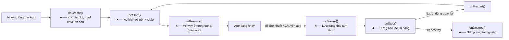
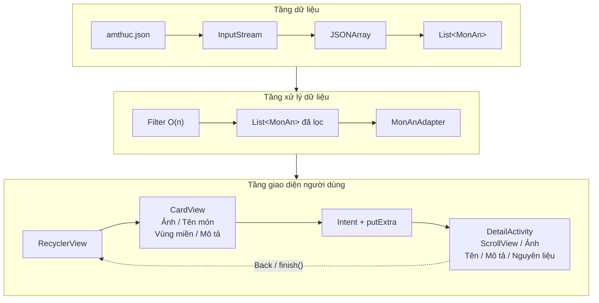

# 📱 Android Apps – PHÁT TRIỂN ỨNG DỤNG TRÊN THIẾT BỊ DI ĐỘNG - TEE0419

> **Sinh viên:** Nguyễn Như Khiêm  
> **MSSV:** K225480106030   
> **Môn học:** PHÁT TRIỂN ỨNG DỤNG TRÊN THIẾT BỊ DI ĐỘNG - TEE0419

---

## 📑 Mục Lục

- [Tổng Quan](#tổng-quan)
- [Kiến Thức Nền Tảng Android](#kiến-thức-nền-tảng-android)
  - [AndroidManifest.xml](#1-androidmanifestxml)
  - [Vòng Đời Ứng Dụng Android](#2-vòng-đời-ứng-dụng-android)
  - [Kiểm Tra Quyền Runtime](#3-kiểm-tra-quyền-runtime-java)
  - [Giao Diện XML Layout](#4-giao-diện-reslayout--xml)
  - [Tránh Hardcode – Dùng Resources](#5-tránh-hardcode--dùng-resources)
  - [ViewGroup – Layout Container](#6-viewgroup--layout-container)
  - [Tương Tác Layout từ Code Java](#7-tương-tác-layout-từ-code-java)
  - [Xử Lý Sự Kiện – Event Handling](#8-xử-lý-sự-kiện--event-handling)
  - [Thư Mục Assets](#9-thư-mục-assets)
- [App 1 – Ẩm Thực Việt Nam](#app-1--ẩm-thực-việt-nam)
- [App 2 – Giải Toán & API](#app-2--giải-toán--api)
---

## Tổng Quan

| | App 1 | App 2 |
|---|---|---|
| **Tên** | Ẩm Thực Việt Nam | Giải Toán & API |
| **Mục tiêu** | Giới thiệu món ăn 3 miền | 3 Activity, gọi API, WebView |
| **Kỹ thuật chính** | Assets, JSON, RecyclerView | Intent, OkHttp, WebView |
| **Ngôn ngữ** | Java | Java |
| **Min SDK** | API 24 (Android 7.0) | API 24 (Android 7.0) |

---

## Kiến Thức Nền Tảng Android

### 1. AndroidManifest.xml

**Mô tả:** Đây là file khai báo trung tâm của mọi ứng dụng Android. Hệ điều hành đọc file này trước khi chạy app để biết:

| Nội dung khai báo | Ý nghĩa |
|---|---|
| Package name | Định danh duy nhất của app trên thiết bị & Play Store |
| Các Activity, Service, Receiver | Những thành phần nào tồn tại trong app |
| Quyền (Permissions) | App cần truy cập những tài nguyên hệ thống nào |
| Intent Filter | Activity nào là màn hình khởi động (`MAIN + LAUNCHER`) |
| Min/Target SDK | App chạy được trên Android phiên bản nào |

**Khai báo quyền (Permissions):**

```xml
<!-- AndroidManifest.xml -->
<manifest xmlns:android="http://schemas.android.com/apk/res/android"
    package="com.example.myapp">

    <!-- Quyền truy cập Internet -->
    <uses-permission android:name="android.permission.INTERNET" />

    <!-- Quyền đọc bộ nhớ ngoài -->
    <uses-permission android:name="android.permission.READ_EXTERNAL_STORAGE" />

    <!-- Quyền truy cập Camera -->
    <uses-permission android:name="android.permission.CAMERA" />

    <!-- Quyền truy cập vị trí -->
    <uses-permission android:name="android.permission.ACCESS_FINE_LOCATION" />

    <application
        android:allowBackup="true"
        android:icon="@mipmap/ic_launcher"
        android:label="@string/app_name"
        android:theme="@style/Theme.MyApp">

        <activity
            android:name=".MainActivity"
            android:exported="true">
            <intent-filter>
                <!-- Đây là Activity khởi động đầu tiên -->
                <action android:name="android.intent.action.MAIN" />
                <category android:name="android.intent.category.LAUNCHER" />
            </intent-filter>
        </activity>

        <activity android:name=".SecondActivity" android:exported="false"/>

    </application>
</manifest>
```

> 💡 **Tại sao phải khai báo?**  
> Android theo mô hình bảo mật "sandbox" – mỗi app chỉ có quyền truy cập những gì đã được người dùng cho phép. Khai báo trong Manifest là bước 1; với Android 6.0+ còn cần xin quyền tại runtime (xem mục 3).

---

### 2. Vòng Đời Ứng Dụng Android

**Vòng đời Activity (Activity Lifecycle):**


**Tại sao Android Studio tự sinh sẵn `onCreate()`?**

```java
public class MainActivity extends AppCompatActivity {

    @Override
    protected void onCreate(Bundle savedInstanceState) {
        super.onCreate(savedInstanceState);
        setContentView(R.layout.activity_main); // Gắn file XML layout vào Activity
        
        // ► Đây là nơi bạn viết code khởi tạo:
        //   - Tìm các View (findViewById)
        //   - Gắn listener cho button
        //   - Load dữ liệu ban đầu
    }
}
```

> 💡 **Lý do:** `onCreate()` là callback **đầu tiên và bắt buộc** trong vòng đời – nó chỉ được gọi **1 lần duy nhất** khi Activity được tạo. Đây là thời điểm phù hợp nhất để khởi tạo UI và dữ liệu ban đầu. Android Studio sinh sẵn để lập trình viên không bỏ sót bước quan trọng này.

---

### 3. Kiểm Tra Quyền Runtime (Java)

Từ Android 6.0 (API 23), các quyền "nguy hiểm" (camera, vị trí, storage...) phải được **xin tại runtime**, không chỉ khai báo trong Manifest.

```java
import androidx.core.app.ActivityCompat;
import androidx.core.content.ContextCompat;
import android.Manifest;
import android.content.pm.PackageManager;

public class MainActivity extends AppCompatActivity {

    private static final int REQUEST_CODE_CAMERA = 100;

    @Override
    protected void onCreate(Bundle savedInstanceState) {
        super.onCreate(savedInstanceState);
        setContentView(R.layout.activity_main);

        checkAndRequestCameraPermission();
    }

    // Bước 1: Kiểm tra xem app đã có quyền chưa
    private void checkAndRequestCameraPermission() {
        if (ContextCompat.checkSelfPermission(this, Manifest.permission.CAMERA)
                == PackageManager.PERMISSION_GRANTED) {
            // ✅ Đã có quyền → thực hiện tác vụ
            openCamera();
        } else {
            // ❌ Chưa có quyền → xin quyền từ người dùng
            ActivityCompat.requestPermissions(
                this,
                new String[]{Manifest.permission.CAMERA},
                REQUEST_CODE_CAMERA
            );
        }
    }

    // Bước 2: Nhận kết quả người dùng chọn Allow / Deny
    @Override
    public void onRequestPermissionsResult(int requestCode,
            String[] permissions, int[] grantResults) {
        super.onRequestPermissionsResult(requestCode, permissions, grantResults);
        
        if (requestCode == REQUEST_CODE_CAMERA) {
            if (grantResults.length > 0
                    && grantResults[0] == PackageManager.PERMISSION_GRANTED) {
                // ✅ Người dùng cho phép
                openCamera();
            } else {
                // ❌ Người dùng từ chối
                Toast.makeText(this, "Cần quyền camera để sử dụng tính năng này",
                    Toast.LENGTH_SHORT).show();
            }
        }
    }

    private void openCamera() {
        // Logic mở camera ở đây
    }
}
```

> **Ý nghĩa:**  
> - `checkSelfPermission()` → trả về `PERMISSION_GRANTED` hoặc `PERMISSION_DENIED`  
> - `requestPermissions()` → hiển thị dialog hệ thống xin quyền  
> - `onRequestPermissionsResult()` → callback nhận kết quả người dùng chọn  

---

### 4. Giao Diện `res/layout` – XML

Giao diện Android được mô tả bằng file XML trong thư mục `res/layout/`. Android Studio cung cấp **UI Design Editor** để kéo thả trực quan, đồng thời sinh ra XML tương ứng.

```xml
<!-- res/layout/activity_main.xml -->
<?xml version="1.0" encoding="utf-8"?>
<LinearLayout
    xmlns:android="http://schemas.android.com/apk/res/android"
    android:layout_width="match_parent"
    android:layout_height="match_parent"
    android:orientation="vertical"
    android:padding="16dp">

    <TextView
        android:id="@+id/tvTitle"
        android:layout_width="match_parent"
        android:layout_height="wrap_content"
        android:text="@string/app_title"
        android:textSize="@dimen/title_size"
        android:textColor="@color/primary" />

    <Button
        android:id="@+id/btnClick"
        android:layout_width="wrap_content"
        android:layout_height="wrap_content"
        android:text="@string/btn_label"
        android:onClick="onButtonClick" />

</LinearLayout>
```

**Giải thích các thuộc tính quan trọng:**

| Thuộc tính | Giá trị | Ý nghĩa |
|---|---|---|
| `layout_width` | `match_parent` | Chiều rộng = parent |
| `layout_width` | `wrap_content` | Chiều rộng vừa đủ nội dung |
| `id` | `@+id/tvTitle` | Đặt ID để tìm từ Java |
| `text` | `@string/app_title` | Tham chiếu tới strings.xml |
| `orientation` | `vertical` / `horizontal` | Hướng sắp xếp con |

---

### 5. Tránh Hardcode – Dùng Resources

#### ❌ Cách SAI (hardcode trực tiếp):
```xml
<TextView android:text="Xin chào" android:textColor="#FF0000" android:textSize="18sp"/>
```

#### ✅ Cách ĐÚNG (dùng tham chiếu):
```xml
<TextView 
    android:text="@string/greeting"
    android:textColor="@color/primary"
    android:textSize="@dimen/body_text_size"/>
```

**Khai báo các giá trị trong file resource:**

```xml
<!-- res/values/strings.xml -->
<resources>
    <string name="app_name">Ẩm Thực Việt Nam</string>
    <string name="greeting">Xin chào!</string>
    <string name="btn_label">Khám phá</string>
</resources>

<!-- res/values/colors.xml -->
<resources>
    <color name="primary">#E53935</color>
    <color name="background">#FFFFFF</color>
</resources>

<!-- res/values/dimens.xml -->
<resources>
    <dimen name="title_size">22sp</dimen>
    <dimen name="body_text_size">16sp</dimen>
</resources>
```

**Cú pháp tham chiếu:**

| Loại resource | Trong XML | Trong Java |
|---|---|---|
| String | `@string/tên` | `getString(R.string.tên)` |
| Color | `@color/tên` | `getColor(R.color.tên)` |
| Dimen | `@dimen/tên` | `getResources().getDimension(R.dimen.tên)` |
| Drawable | `@drawable/tên` | `getDrawable(R.drawable.tên)` |

#### Ưu điểm của việc dùng tham chiếu:

| Ưu điểm | Giải thích |
|---|---|
| **Đa ngôn ngữ (i18n)** | Tạo `res/values-vi/strings.xml`, `res/values-en/strings.xml` – OS tự chọn theo ngôn ngữ thiết bị |
| **Đa theme** | Tạo `res/values-night/colors.xml` – OS tự chọn Dark/Light mode |
| **Đa vùng (Locale)** | Tạo `res/values-vi-rVN/` – định dạng ngày, tiền tệ tự động |
| **Dễ bảo trì** | Thay đổi 1 nơi, áp dụng toàn app |
| **Tránh lỗi nhất quán** | Không có chỗ dùng màu #FF0000, chỗ dùng #ff0000 |

#### Cơ chế Auto theo LOCATION / LANGUAGE / THEME:

```
res/
├── values/                  ← mặc định (tiếng Anh, Light mode)
│   ├── strings.xml
│   └── colors.xml
├── values-vi/               ← Tự động dùng khi thiết bị đặt tiếng Việt
│   └── strings.xml
├── values-night/            ← Tự động dùng khi Dark Mode
│   └── colors.xml
├── values-en-rUS/           ← Tự động dùng khi locale = US English
│   └── strings.xml
└── values-vi-rVN/           ← Tự động dùng khi locale = Vietnamese (VN)
    └── strings.xml
```

> 💡 App tự động hỗ trợ **đa ngôn ngữ, dark mode, và bản địa hoá** mà không cần viết thêm code logic – chỉ cần tạo đúng thư mục resource!

---

### 6. ViewGroup – Layout Container

**ViewGroup** là đối tượng chứa, gộp các View con lại theo một quy luật sắp xếp nhất định.

#### LinearLayout – sắp xếp tuần tự

```xml
<!-- Sắp xếp các con theo chiều DỌC -->
<LinearLayout
    android:layout_width="match_parent"
    android:layout_height="wrap_content"
    android:orientation="vertical"
    android:gravity="center_horizontal">

    <TextView android:text="@string/item1" .../>
    <TextView android:text="@string/item2" .../>
    <Button   android:text="@string/btn"   .../>

</LinearLayout>

<!-- Sắp xếp các con theo chiều NGANG -->
<LinearLayout
    android:orientation="horizontal"
    android:gravity="center_vertical"
    ...>

    <ImageView .../>
    <TextView  .../>

</LinearLayout>
```

**Thuộc tính `gravity` vs `layout_gravity`:**

| Thuộc tính | Ý nghĩa |
|---|---|
| `android:gravity` | Căn chỉnh **nội dung bên trong** View/ViewGroup |
| `android:layout_gravity` | Căn chỉnh **bản thân View** trong ViewGroup cha |

```xml
<!-- gravity các giá trị phổ biến -->
android:gravity="center"             <!-- giữa cả 2 chiều -->
android:gravity="center_horizontal"  <!-- giữa theo chiều ngang -->
android:gravity="center_vertical"    <!-- giữa theo chiều dọc -->
android:gravity="start"              <!-- trái (RTL-aware) -->
android:gravity="end"                <!-- phải (RTL-aware) -->
android:gravity="top|start"          <!-- trái trên (kết hợp bằng |) -->
```

#### Các ViewGroup phổ biến khác:

| ViewGroup | Đặc điểm |
|---|---|
| `ConstraintLayout` | Định vị bằng ràng buộc, linh hoạt nhất, khuyên dùng |
| `RelativeLayout` | Định vị tương đối so với nhau |
| `FrameLayout` | Chồng lên nhau (overlay) |
| `RecyclerView` | Danh sách cuộn tối ưu hiệu năng |

---

### 7. Tương Tác Layout từ Code Java

#### Lấy reference tới View và hiển thị text:

```java
public class MainActivity extends AppCompatActivity {

    private TextView tvGreeting;
    private Button btnAction;

    @Override
    protected void onCreate(Bundle savedInstanceState) {
        super.onCreate(savedInstanceState);
        setContentView(R.layout.activity_main);

        // Tìm View theo ID đã khai báo trong XML
        tvGreeting = findViewById(R.id.tvGreeting);
        btnAction  = findViewById(R.id.btnAction);

        // ❌ Cách SAI: hardcode text
        // tvGreeting.setText("Xin chào");

        // ✅ Cách ĐÚNG: lấy string từ resources
        // → Tự động theo ngôn ngữ/theme của thiết bị
        tvGreeting.setText(getString(R.string.greeting));

        // Hiển thị string có tham số (placeholder)
        // strings.xml: <string name="welcome">Chào, %1$s!</string>
        String name = "An";
        tvGreeting.setText(getString(R.string.welcome, name));
    }
}
```

> **Tại sao dùng `getString(R.string.xxx)` thay vì hardcode?**  
> Khi thiết bị đổi ngôn ngữ sang tiếng Anh, `R.string.greeting` tự động trả về giá trị từ `values-en/strings.xml`. Nếu hardcode `"Xin chào"` thì không bao giờ đổi được.

---

### 8. Xử Lý Sự Kiện – Event Handling

#### Layout cần làm gì?

Gán `android:id` cho View để Java tìm được, hoặc dùng `android:onClick` trực tiếp.

```xml
<!-- Cách 1: Dùng android:onClick trong XML -->
<Button
    android:id="@+id/btnSubmit"
    android:layout_width="wrap_content"
    android:layout_height="wrap_content"
    android:text="@string/submit"
    android:onClick="onSubmitClick" />
<!-- Tên hàm phải khớp với method trong Activity -->
```

#### Cách 1 – Khai báo `onClick` trong XML, xử lý trong Java:

```java
// Trong Activity – tên hàm PHẢI khớp với android:onClick="onSubmitClick"
public void onSubmitClick(View view) {
    // Đoạn code chạy khi người dùng click button
    Toast.makeText(this, "Đã click!", Toast.LENGTH_SHORT).show();
}
```

#### Cách 2 – Gán `setOnClickListener` trong Java (linh hoạt hơn):

```java
@Override
protected void onCreate(Bundle savedInstanceState) {
    super.onCreate(savedInstanceState);
    setContentView(R.layout.activity_main);

    Button btnSubmit = findViewById(R.id.btnSubmit);

    // Gán listener trực tiếp bằng Anonymous Class
    btnSubmit.setOnClickListener(new View.OnClickListener() {
        @Override
        public void onClick(View v) {
            // Đoạn code chạy khi click
            Toast.makeText(MainActivity.this, "Đã click!", Toast.LENGTH_SHORT).show();
        }
    });

    // Hoặc viết gọn bằng Lambda (Java 8+)
    btnSubmit.setOnClickListener(v -> {
        Toast.makeText(this, "Đã click!", Toast.LENGTH_SHORT).show();
    });

    // Các sự kiện khác:
    TextView tvItem = findViewById(R.id.tvItem);
    tvItem.setOnClickListener(v -> { /* click vào text */ });
    tvItem.setOnLongClickListener(v -> {
        /* giữ lâu */
        return true; // true = đã xử lý, không bubble up
    });
}
```

**So sánh 2 cách:**

| | Cách 1 (XML onClick) | Cách 2 (setOnClickListener) |
|---|---|---|
| Khai báo | Trong XML | Trong Java |
| Linh hoạt | Thấp | Cao (gán/bỏ gán động) |
| Dùng Lambda | Không | Có |
| Phù hợp | Button đơn giản | Mọi trường hợp |

---

### 9. Thư Mục Assets

**Assets** là thư mục đặc biệt trong Android project, dùng để đóng gói file tĩnh vào bên trong APK.

#### Vị trí trong project:
```
app/
└── src/
    └── main/
        ├── assets/          ◄── Thư mục này
        │   ├── data/
        │   │   └── amthuc.json
        │   └── images/
        │       └── pho.jpg
        ├── java/
        └── res/
```

#### Cách copy file vào Assets:
1. Mở **Windows Explorer / Finder**
2. Tìm đường dẫn: `[Project]/app/src/main/assets/`
3. Copy file/folder vào đó
4. Rebuild project → file sẽ được đóng gói vào APK

#### Cú pháp truy cập trong Java:

```java
// Đọc file text (JSON, TXT, CSV...)
try {
    AssetManager assetManager = getAssets();
    
    // Mở file
    InputStream inputStream = assetManager.open("data/amthuc.json");
    
    // Đọc thành String
    int size = inputStream.available();
    byte[] buffer = new byte[size];
    inputStream.read(buffer);
    inputStream.close();
    String jsonString = new String(buffer, "UTF-8");
    
    // Xử lý dữ liệu JSON
    JSONArray jsonArray = new JSONArray(jsonString);

} catch (IOException | JSONException e) {
    e.printStackTrace();
}

// Đọc file ảnh (Bitmap)
try {
    InputStream imgStream = getAssets().open("images/pho.jpg");
    Bitmap bitmap = BitmapFactory.decodeStream(imgStream);
    imageView.setImageBitmap(bitmap);
} catch (IOException e) {
    e.printStackTrace();
}

// Liệt kê tất cả file trong 1 thư mục Assets
try {
    String[] files = getAssets().list("images");
    for (String file : files) {
        Log.d("ASSETS", "File: " + file);
    }
} catch (IOException e) {
    e.printStackTrace();
}
```

#### Lợi ích của Assets:

| Lợi ích | Giải thích |
|---|---|
| ✅ **Offline hoàn toàn** | App có data ngay cả khi không có mạng |
| ✅ **Tốc độ nhanh** | Đọc từ local, không cần request mạng |
| ✅ **Đảm bảo dữ liệu** | Data luôn có, không phụ thuộc server |
| ✅ **Bảo mật hơn** | Không lộ API endpoint khi offline |
| ✅ **Tiết kiệm băng thông** | Không tải lại data đã có sẵn |

> **Ứng dụng thực tế:** App hướng dẫn nấu ăn, từ điển offline, app học ngoại ngữ, bản đồ offline, sách điện tử...

---

## App 1 – Ẩm Thực Việt Nam

> Ứng dụng giới thiệu các món ăn đặc trưng 3 miền Việt Nam sử dụng dữ liệu chuẩn bị sẵn trong Assets (hoạt động offline hoàn toàn).

### Tổng Quan

| Mục | Chi tiết |
|---|---|
| **Vấn đề** | Người dùng muốn tra cứu món ăn Việt Nam kể cả khi offline |
| **Giải pháp** | Dữ liệu JSON + ảnh đóng gói sẵn trong Assets |
| **Dữ liệu** | `amthuc.json` – mảng JSON các món ăn theo vùng miền |
| **Thuật toán** | Parse JSON → List → Filter theo vùng |
| **Hiển thị** | RecyclerView + CardView + ImageView từ Assets |
| **Ngôn ngữ** | Java |
| **Min SDK** | API 24 (Android 7.0) |


#### 1. Tự Đặt Vấn Đề

**Vấn đề đặt ra:**  
Người học muốn tra cứu các món ăn đặc trưng 3 miền Việt Nam — bao gồm tên, hình ảnh, nguyên liệu và cách nhận biết — kể cả khi **không có kết nối Internet** (đang đi du lịch, vùng sóng yếu, v.v.).

**Giải pháp chọn:**  
Đóng gói toàn bộ dữ liệu (file JSON + ảnh) vào thư mục `assets/` ngay trong app. Khi app được cài lên thiết bị, dữ liệu đi kèm theo — không cần gọi API, không cần mạng.

---

#### 2. Mô Tả Đặc Thù Dữ Liệu

Dữ liệu được lưu tại `assets/data/amthuc.json` — là một **mảng JSON phẳng** (flat array), mỗi phần tử đại diện cho một món ăn.

##### 2.1 Cấu trúc một phần tử

```json
{
  "id": 1,
  "ten": "Phở Bò",
  "vung": "Bắc",
  "mo_ta": "Món ăn truyền thống...",
  "nguyen_lieu": ["Xương bò", "Bánh phở", "Hành tây"],
  "image": "images/pho.jpg",
  "dac_trung": "Nước dùng trong, thanh ngọt",
  "do_kho": 3
}
```

##### 2.2 Đặc thù đáng chú ý

| Trường | Kiểu | Đặc thù |
|---|---|---|
| `vung` | String | Giá trị rời rạc: `"Bắc"` / `"Trung"` / `"Nam"` → phù hợp để **phân nhóm, filter** |
| `nguyen_lieu` | **JSONArray lồng** | Mảng bên trong mảng → phải parse 2 cấp, không thể đọc thẳng như String |
| `image` | String (đường dẫn tương đối) | Không phải URL mạng, là đường dẫn trong `assets/` → phải dùng `AssetManager` để mở |
| `do_kho` | int (1–3) | Dữ liệu số nguyên → có thể hiển thị dạng icon 🔥 hoặc sắp xếp theo độ khó |
| `id` | int | Định danh duy nhất → dùng khi cần tra cứu hoặc so sánh chính xác |

**Kết luận đặc thù:**  
Dữ liệu có **trường phân loại rời rạc** (`vung`) và **trường lồng** (`nguyen_lieu`) — đây là 2 điểm cần xử lý đặc biệt, không thể đọc và hiển thị trực tiếp mà không qua bước parse.

---

#### 3. Có Cần Tiền Xử Lý Trước Khi Hiển Thị Không?

**Có — cần tiền xử lý ở 2 điểm:**

##### 3.1 Parse JSON → Object Java

Dữ liệu trong Assets là **chuỗi văn bản thuần túy** (raw text). Không thể gán thẳng vào TextView hay ImageView. Phải trải qua pipeline:

```
File JSON (text)
    → đọc bằng InputStream
    → chuyển thành String (UTF-8)
    → parse bằng JSONArray / JSONObject
    → tạo đối tượng MonAn (Java)
    → đưa vào List<MonAn>
    → truyền cho Adapter để hiển thị
```

##### 3.2 Xử lý trường `nguyen_lieu` (mảng lồng)

Trường này là `JSONArray` bên trong `JSONObject` — phải parse vòng lặp riêng:

```java
JSONArray nlArr = obj.getJSONArray("nguyen_lieu");
List<String> nguyenLieu = new ArrayList<>();
for (int j = 0; j < nlArr.length(); j++) {
    nguyenLieu.add(nlArr.getString(j));
}
```

Khi truyền sang `DetailActivity`, danh sách này tiếp tục được **tiền xử lý thêm một lần nữa** — nối thành chuỗi hiển thị với ký tự `•`:

```java
StringBuilder sb = new StringBuilder();
for (String nl : mon.getNguyen_lieu()) {
    sb.append("• ").append(nl).append("\n");
}
intent.putExtra("MON_NGUYEN_LIEU", sb.toString().trim());
```

**Lý do cần bước này:** `TextView` chỉ nhận `String`, không nhận `List<String>` trực tiếp.

##### 3.3 Load ảnh từ Assets

Đường dẫn `"images/pho.jpg"` trong JSON không phải URL — phải mở thủ công qua `AssetManager` và decode thành `Bitmap`:

```java
InputStream is = context.getAssets().open(mon.getImage());
Bitmap bitmap = BitmapFactory.decodeStream(is);
holder.imgMon.setImageBitmap(bitmap);
```

---

#### 4. Thuật Toán Xử Lý Dữ Liệu

##### 4.1 Thuật toán Filter theo vùng miền

**Bài toán:** Người dùng nhấn "Miền Bắc" → chỉ hiển thị các món có `vung == "Bắc"`.

**Thuật toán:** Duyệt tuyến tính — **O(n)**

```
Đầu vào : danhSachTatCa (List đầy đủ), vung (String bộ lọc)
Đầu ra  : danhSachHienThi (List đã lọc)

1. Xoá toàn bộ danhSachHienThi
2. Nếu vung == "all":
       Thêm tất cả phần tử từ danhSachTatCa vào danhSachHienThi
   Ngược lại:
       Duyệt từng MonAn trong danhSachTatCa:
           Nếu MonAn.getVung() == vung:
               Thêm MonAn vào danhSachHienThi
3. Gọi adapter.notifyDataSetChanged() để cập nhật UI
```

**Tại sao không cần thuật toán phức tạp hơn?**  
Dữ liệu chỉ có ~6 phần tử (có thể mở rộng đến vài trăm). Với kích thước nhỏ, O(n) là lựa chọn đơn giản, đủ hiệu quả và dễ bảo trì. Nếu dữ liệu lớn hơn (hàng nghìn món), có thể cân nhắc **pre-group** — phân nhóm sẵn thành `Map<String, List<MonAn>>` khi load, tra cứu O(1).

##### 4.2 Thuật toán Parse JSON (đọc một lần khi khởi động)

Chỉ chạy **một lần duy nhất** trong `onCreate` → kết quả lưu vào `danhSachTatCa`. Các lần filter sau đó không đọc lại file — tiết kiệm I/O.

---

#### 5. Đối Tượng Hiển Thị Dữ Liệu

##### 5.1 Màn hình danh sách — RecyclerView + CardView

| Lý do chọn RecyclerView | Giải thích |
|---|---|
| **ViewHolder pattern** | Tái sử dụng View đã inflate, không tạo mới mỗi lần scroll → tiết kiệm bộ nhớ, mượt mà |
| **Chỉ render View đang hiển thị** | Không render toàn bộ 100 item cùng lúc → phù hợp danh sách dài |
| **Dễ cập nhật** | `notifyDataSetChanged()` sau filter → UI tự cập nhật |

**CardView** bọc ngoài mỗi item → tạo hiệu ứng nổi (elevation), bo góc, dễ nhìn.

##### 5.2 Màn hình chi tiết — ScrollView + LinearLayout

Nội dung chi tiết (ảnh lớn + văn bản dài) có thể vượt quá chiều cao màn hình → dùng `ScrollView` để cuộn. Bên trong dùng `LinearLayout` (orientation: vertical) để xếp các thành phần từ trên xuống theo thứ tự tự nhiên.

##### 5.3 Sơ đồ luồng hiển thị


---

#### 6. Lợi Ích Của Cơ Chế Assets

| Lợi ích | Giải thích |
|---|---|
| **Offline hoàn toàn** | Dữ liệu đi kèm app, không phụ thuộc mạng |
| **Tốc độ** | Đọc từ bộ nhớ thiết bị, nhanh hơn HTTP request |
| **Đơn giản** | Không cần server, không cần xử lý lỗi mạng |
| **Phù hợp nội dung tĩnh** | Danh mục món ăn, từ điển, hướng dẫn — ít thay đổi theo thời gian |

**Cú pháp truy cập Assets:**
```java
// Đọc file text/JSON
InputStream is = getAssets().open("data/amthuc.json");

// Đọc file ảnh
InputStream is = getAssets().open("images/pho.jpg");
Bitmap bmp = BitmapFactory.decodeStream(is);
```

**Giới hạn cần lưu ý:** Dữ liệu trong Assets là **chỉ đọc** — không thể ghi/sửa từ code. Nếu cần dữ liệu cập nhật thường xuyên, phải dùng API hoặc database.

---

## Bước 1 – Tạo Project Mới

### 1.1 Mở Android Studio → New Project

```
File → New → New Project
```

### 1.2 Chọn Template

- Chọn **"Empty Views Activity"**
- Click **Next**


### 1.3 Cấu Hình Project

Điền thông tin như sau:

| Trường | Giá trị |
|---|---|
| **Name** | `AmThucVietNam` |
| **Package name** | `com.example.amthucvietnam` |
| **Save location** | Chọn thư mục bạn muốn lưu |
| **Language** | `Java` |
| **Minimum SDK** | `API 24 ("Nougat"; Android 7.0)` |


- Click **Finish** → Chờ Android Studio tạo project và sync Gradle lần đầu (~1-3 phút)


### 1.4 Cấu Trúc Project Sau Khi Tạo

```
App1_AmThucVietNam/
├── app/
│   ├── src/main/
│   │   ├── java/com/example/amthucvietnam/
│   │   │   └── MainActivity.java       ← File Java tự sinh
│   │   ├── res/
│   │   │   ├── layout/
│   │   │   │   └── activity_main.xml   ← Layout tự sinh
│   │   │   └── values/
│   │   │       ├── strings.xml
│   │   │       ├── colors.xml
│   │   │       └── themes.xml
│   │   └── AndroidManifest.xml
│   └── build.gradle                    ← Gradle cấp app
└── build.gradle                        ← Gradle cấp project
```


---

## Bước 2 – Cấu Hình build.gradle

Mở file `app/build.gradle.kts` và kiểm tra / thêm:

```gradle
android {
    compileSdk = 34

    defaultConfig {
        applicationId = "com.example.amthucvietnam"
        minSdk = 24
        targetSdk = 34
        versionCode = 1
        versionName = "1.0"
    }

    buildTypes {
        getByName("release") {
            isMinifyEnabled = false
        }
    }

    compileOptions {
        sourceCompatibility = JavaVersion.VERSION_1_8
        targetCompatibility = JavaVersion.VERSION_1_8
    }
}

dependencies {
    implementation("androidx.appcompat:appcompat:1.6.1")
    implementation("com.google.android.material:material:1.11.0")
    implementation("androidx.constraintlayout:constraintlayout:2.1.4")

    // RecyclerView – hiển thị danh sách
    implementation("androidx.recyclerview:recyclerview:1.3.2")
    // CardView – hiệu ứng card cho từng item
    implementation("androidx.cardview:cardview:1.0.0")
}
```

Sau khi sửa → Click **"Sync Now"** (thanh vàng xuất hiện phía trên)


---

## Bước 3 – Tạo Thư Mục Assets & Chuẩn Bị Dữ Liệu

### 3.1 Tạo thư mục Assets trong Android Studio

```
Chuột phải vào thư mục main → New → Directory
→ Gõ: assets
→ Enter
```


### 3.2 Tạo cấu trúc thư mục con


Tạo thủ công 2 thư mục con:
```
assets/
├── data/        ← chứa file JSON
└── images/      ← chứa ảnh các món ăn
```


### 3.3 Tạo file `amthuc.json`

Trong thư mục `assets/data/`, tạo file `amthuc.json`:

```json
[
  {
    "id": 1,
    "ten": "Phở Bò",
    "vung": "Bắc",
    "mo_ta": "Món ăn truyền thống của người Hà Nội, nổi tiếng với nước dùng trong và ngọt từ xương bò hầm nhiều giờ cùng các gia vị hồi, quế, gừng.",
    "nguyen_lieu": ["Xương bò", "Bánh phở", "Thịt bò tái", "Hành tây", "Gừng nướng", "Quế", "Hồi", "Rau thơm"],
    "image": "images/pho.jpg",
    "dac_trung": "Nước dùng trong, thanh ngọt, thơm mùi hồi quế",
    "do_kho": 3
  },
  {
    "id": 2,
    "ten": "Bún Chả",
    "vung": "Bắc",
    "mo_ta": "Bún chả Hà Nội gồm bún tươi, chả viên và chả miếng nướng than hoa, chấm nước mắm pha chua ngọt.",
    "nguyen_lieu": ["Bún tươi", "Thịt nạc vai", "Thịt ba chỉ", "Nước mắm", "Tỏi", "Ớt", "Chanh", "Rau sống"],
    "image": "images/buncha.jpg",
    "dac_trung": "Chả nướng than hoa, nước chấm chua ngọt đặc trưng",
    "do_kho": 2
  },
  {
    "id": 3,
    "ten": "Bún Bò Huế",
    "vung": "Trung",
    "mo_ta": "Bún bò Huế nổi tiếng với nước dùng đậm đà, cay nồng từ sả và mắm ruốc, ăn kèm giò heo và huyết.",
    "nguyen_lieu": ["Bún tươi", "Thịt bò", "Giò heo", "Sả", "Mắm ruốc", "Ớt", "Hành tím", "Rau sống"],
    "image": "images/bunbohue.jpg",
    "dac_trung": "Nước dùng đỏ cay nồng, thơm sả mắm ruốc",
    "do_kho": 2
  },
  {
    "id": 4,
    "ten": "Mì Quảng",
    "vung": "Trung",
    "mo_ta": "Mì Quảng đặc trưng với sợi mì vàng rộng bản, ít nước dùng sền sệt, ăn kèm tôm thịt và bánh tráng nướng.",
    "nguyen_lieu": ["Mì Quảng", "Tôm", "Thịt heo", "Trứng cút", "Đậu phộng", "Bánh tráng nướng", "Rau sống"],
    "image": "images/miquang.jpg",
    "dac_trung": "Ít nước, sợi mì vàng, ăn với bánh tráng nướng giòn",
    "do_kho": 2
  },
  {
    "id": 5,
    "ten": "Bánh Mì Sài Gòn",
    "vung": "Nam",
    "mo_ta": "Bánh mì Sài Gòn nổi tiếng toàn thế giới với vỏ bánh giòn tan, nhân đa dạng gồm pate, chả lụa, thịt nguội, dưa chua và rau thơm.",
    "nguyen_lieu": ["Bánh mì", "Pate", "Chả lụa", "Thịt nguội", "Dưa chua", "Dưa leo", "Rau mùi", "Tương ớt"],
    "image": "images/banhmi.jpg",
    "dac_trung": "Vỏ giòn tan, nhân phong phú, ăn nhanh tiện lợi",
    "do_kho": 1
  },
  {
    "id": 6,
    "ten": "Hủ Tiếu Nam Vang",
    "vung": "Nam",
    "mo_ta": "Hủ tiếu Nam Vang có nước dùng trong ngọt từ xương heo, ăn kèm thịt nạc, tôm, gan heo và các loại rau giá.",
    "nguyen_lieu": ["Hủ tiếu", "Xương heo", "Tôm tươi", "Thịt nạc", "Gan heo", "Giá đỗ", "Hành lá", "Tỏi phi"],
    "image": "images/hutieu.jpg",
    "dac_trung": "Nước dùng trong, ngọt thanh, ăn khô hoặc nước đều được",
    "do_kho": 2
  }
]
```


### 3.4 Copy ảnh vào thư mục `assets/images/`

- Tìm hoặc tải ảnh các món ăn (JPG/PNG)
- Đổi tên ảnh đúng với trường `"image"` trong JSON: `pho.jpg`, `buncha.jpg`, `bunbohue.jpg`, `miquang.jpg`, `banhmi.jpg`, `hutieu.jpg`
- Copy vào `assets/images/` bằng Windows Explorer


---

## Bước 4 – Khai Báo Resources

### 4.1 `res/values/strings.xml`

```xml
<resources>
    <string name="app_name">Ẩm Thực Việt Nam</string>
    <string name="all_regions">Tất Cả</string>
    <string name="north">Miền Bắc</string>
    <string name="central">Miền Trung</string>
    <string name="south">Miền Nam</string>
    <string name="ingredients_title">Nguyên liệu</string>
    <string name="specialty_title">Đặc trưng</string>
    <string name="region_label">Vùng miền</string>
    <string name="error_load_data">Lỗi tải dữ liệu!</string>
    <string name="no_result">Không có món ăn nào.</string>
</resources>
```


### 4.2 `res/values/colors.xml`

```xml
<resources>
    <color name="primary">#C62828</color>
    <color name="primary_dark">#8E0000</color>
    <color name="accent">#FF8F00</color>
    <color name="background">#FFF8F0</color>
    <color name="card_background">#FFFFFF</color>
    <color name="text_primary">#212121</color>
    <color name="text_secondary">#757575</color>
    <color name="badge_bac">#1565C0</color>
    <color name="badge_trung">#2E7D32</color>
    <color name="badge_nam">#E65100</color>
    <color name="divider">#EEEEEE</color>
</resources>
```


### 4.3 `res/values/dimens.xml`

```xml
<resources>
    <dimen name="title_text_size">20sp</dimen>
    <dimen name="body_text_size">14sp</dimen>
    <dimen name="caption_text_size">12sp</dimen>
    <dimen name="card_margin">8dp</dimen>
    <dimen name="card_padding">12dp</dimen>
    <dimen name="image_height">180dp</dimen>
    <dimen name="card_radius">12dp</dimen>
</resources>
```


---

## Bước 5 – Tạo Data Model

### 5.1 Tạo package `model`

```
Chuột phải vào package gốc (com.example.amthucvietnam)
→ New → Package
→ Gõ: model
→ Enter
```


### 5.2 Tạo class `MonAn.java`

```
Chuột phải vào package model
→ New → Java Class
→ Gõ: MonAn
→ Enter
```


Nội dung file:

```java
package com.example.amthucvietnam.model;

import java.util.List;

public class MonAn {
    private int id;
    private String ten;
    private String vung;
    private String mo_ta;
    private List<String> nguyen_lieu;
    private String image;
    private String dac_trung;
    private int do_kho;

    public MonAn(int id, String ten, String vung, String mo_ta,
                 List<String> nguyen_lieu, String image,
                 String dac_trung, int do_kho) {
        this.id = id;
        this.ten = ten;
        this.vung = vung;
        this.mo_ta = mo_ta;
        this.nguyen_lieu = nguyen_lieu;
        this.image = image;
        this.dac_trung = dac_trung;
        this.do_kho = do_kho;
    }

    public int getId()                   { return id; }
    public String getTen()               { return ten; }
    public String getVung()              { return vung; }
    public String getMo_ta()             { return mo_ta; }
    public List<String> getNguyen_lieu() { return nguyen_lieu; }
    public String getImage()             { return image; }
    public String getDac_trung()         { return dac_trung; }
    public int getDo_kho()               { return do_kho; }
}
```

---

## Bước 6 – Thiết Kế Layout XML

### 6.1 Layout item RecyclerView – `res/layout/item_mon_an.xml`

```
Chuột phải vào res/layout → New → Layout Resource File
→ File name: item_mon_an
→ Root element: androidx.cardview.widget.CardView
→ OK
```


### 6.2 Tạo drawable badge – `res/drawable/badge_background.xml`

```
Chuột phải vào res/drawable → New → Drawable Resource File
→ File name: badge_background
→ OK
```


### 6.3 Layout màn hình chính – `res/layout/activity_main.xml`


### 6.4 Layout màn hình chi tiết – `res/layout/activity_detail.xml`


---

## Bước 7 – Tạo RecyclerView Adapter

### 7.1 Tạo package `adapter`

```
Chuột phải vào package gốc → New → Package → adapter
```

### 7.2 Tạo class `MonAnAdapter.java`

```
Chuột phải vào package adapter → New → Java Class → MonAnAdapter
```


---

## Bước 8 – Viết MainActivity

Mở file `MainActivity.java`:


---

## Bước 9 – Tạo DetailActivity

### 9.1 Tạo Activity mới

```
Chuột phải vào package gốc → New → Activity → Empty Views Activity
→ Activity Name: DetailActivity
→ Layout Name: activity_detail  (tự điền)
→ Finish
```


> **Lưu ý:** Android Studio tự động thêm `<activity android:name=".DetailActivity"/>` vào `AndroidManifest.xml`

### 9.2 Viết `DetailActivity.java`


---

## Bước 10 – Cập Nhật AndroidManifest

Mở `AndroidManifest.xml` và kiểm tra:


---

## Bước 11 – Chạy & Kiểm Tra

### 11.1 Kết nối thiết bị hoặc khởi động Emulator

**Dùng thiết bị thật:**
```
1. Thiết bị: Cài đặt → Giới thiệu điện thoại → Nhấn 7 lần vào "Số hiệu bản dựng"
2. Thiết bị: Bật "Tuỳ chọn lập trình viên" → Bật "Gỡ lỗi USB"
3. Cắm cáp USB vào máy tính
4. Chọn "Cho phép gỡ lỗi USB" trên thiết bị
```

### 11.2 Build & Run

```
Click nút ▶ (Run) trên toolbar
Hoặc: Shift + F10
```


### 11.3 Checklist kiểm tra

## Checklist Kiểm Thử Chức Năng

| STT | Nội dung kiểm thử |
|-----|-------------------|
| 1 | Mở ứng dụng và hiển thị danh sách món ăn |
| 2 | Hiển thị đúng hình ảnh món ăn từ thư mục Assets |
| 3 | Hiển thị chính xác tên món ăn, vùng miền và mô tả |
| 4 | Bộ lọc **"Miền Bắc"** chỉ hiển thị các món thuộc miền Bắc |
| 5 | Bộ lọc **"Tất Cả"** hiển thị lại toàn bộ danh sách món ăn |
| 6 | Nhấn vào món ăn mở được màn hình chi tiết |
| 7 | Màn hình chi tiết hiển thị đầy đủ ảnh, tên món ăn, đặc trưng vùng miền, mô tả và nguyên liệu |
| 8 | Nút **Back** trên `DetailActivity` hoạt động đúng |
| 9 | Ứng dụng hoạt động bình thường khi tắt Wi-Fi (Offline Mode) |


---

## Tổng Kết

### Những gì đã làm được

| Kỹ thuật | Áp dụng |
|---|---|
| **Assets** | Đọc JSON + ảnh không cần Internet |
| **JSON Parsing** | `JSONArray`, `JSONObject` → `List<MonAn>` |
| **RecyclerView + Adapter** | Hiển thị danh sách dạng card có ảnh |
| **Intent + Bundle** | Truyền dữ liệu giữa 2 Activity |
| **Resources** | `@string`, `@color`, `@dimen` – không hardcode |
| **Filter** | Lọc danh sách theo trường `vung` |
| **Offline** | 100% hoạt động không cần mạng |

---

## App 2 – Giải Toán & API

### 📌 Mô Tả Bài Toán

App có **3 Activity**:
- **Activity 1 (About):** Giới thiệu app, điều hướng sang 2 activity còn lại
- **Activity 2 (Giải toán):** Giải phương trình bậc 2 `ax² + bx + c = 0`, gửi kết quả lên API
- **Activity 3 (WebView):** Hiển thị trang web `https://k58kmt.tdh.io.vn?masv=[MSSV]`

---

### 🏗️ Cấu Trúc Project App2

```
App2_GiaiToan/
├── app/src/main/
│   ├── java/.../
│   │   ├── AboutActivity.java       ← Activity 1
│   │   ├── GiaiToanActivity.java    ← Activity 2
│   │   └── WebViewActivity.java     ← Activity 3
│   └── res/layout/
│       ├── activity_about.xml
│       ├── activity_giai_toan.xml
│       └── activity_webview.xml
├── AndroidManifest.xml
└── build.gradle
```

---

# 🧮 App 2 – Giải Toán & API

> Ứng dụng Android có 3 Activity: Giới thiệu, Giải phương trình bậc 2 với gọi API, và WebView.  
> Tương đương với bài tập đã làm trên MIT App Inventor nhưng viết bằng Java trên Android Studio.

---


## Tổng Quan

| Activity | Chức năng | Kỹ thuật |
|---|---|---|
| **AboutActivity** | Màn hình giới thiệu + điều hướng | Intent, Button |
| **GiaiToanActivity** | Giải PT bậc 2, gửi kết quả lên API | OkHttp POST, JSON, Thread |
| **WebViewActivity** | Hiển thị trang web trong app | WebView, WebSettings |

**Luồng điều hướng:**
```
AboutActivity (màn hình chính)
    │
    ├──[Nút Giải Toán]──► GiaiToanActivity
    │                          └── Gọi API POST → https://k58kmt.tdh.io.vn/api
    │
    └──[Nút Xem Web]────► WebViewActivity
                               └── Load https://k58kmt.tdh.io.vn?masv=k225480106030
```

---

## Bước 1 – Tạo Project Mới

### 1.1 Mở Android Studio → New Project

```
File → New → New Project
```

### 1.2 Chọn Template

- Chọn **"Empty Views Activity"**
- Click **Next**


### 1.3 Cấu Hình Project

| Trường | Giá trị |
|---|---|
| **Name** | `GiaiToanAPI` |
| **Package name** | `com.example.giaitoanapi` |
| **Save location** | Thư mục bạn muốn lưu |
| **Language** | `Java` |
| **Minimum SDK** | `API 24 ("Nougat"; Android 7.0)` |


- Click **Finish** → Chờ Gradle sync xong

### 1.4 Đổi tên MainActivity thành AboutActivity

Android Studio tạo sẵn `MainActivity.java`. Ta sẽ dùng nó làm `AboutActivity`:

```
Chuột phải vào MainActivity.java → Refactor → Rename
→ Gõ: AboutActivity
→ Click Refactor
```


> Android Studio tự cập nhật tất cả chỗ tham chiếu, kể cả trong `AndroidManifest.xml`

---

## Bước 2 – Cấu Hình build.gradle

Mở `app/build.gradle`, thêm dependency **OkHttp** để gọi API:

```gradle
android {
    namespace = "com.example.giaitoanapi"
    compileSdk = 34

    defaultConfig {
        applicationId = "com.example.giaitoanapi"
        minSdk = 24
        targetSdk = 34
        versionCode = 1
        versionName = "1.0"
    }

    buildTypes {
        release {
            isMinifyEnabled = false
        }
    }

    compileOptions {
        sourceCompatibility = JavaVersion.VERSION_1_8
        targetCompatibility = JavaVersion.VERSION_1_8
    }
}

dependencies {
    implementation("androidx.appcompat:appcompat:1.6.1")
    implementation("com.google.android.material:material:1.11.0")
    implementation("androidx.constraintlayout:constraintlayout:2.1.4")

    // Thư viện gọi HTTP API
    implementation("com.squareup.okhttp3:okhttp:4.12.0")
}
```

→ Click **"Sync Now"** sau khi lưu


---

## Bước 3 – Khai Báo Resources & Manifest

### 3.1 `res/values/strings.xml`

```xml
<resources>
    <string name="app_name">Giải Toán API</string>

    <!-- About Activity -->
    <string name="about_title">About me</string>
    <string name="about_description">Ứng dụng minh hoạ 3 Activity:\n• Giải phương trình bậc 2\n• Gửi kết quả lên API\n• Xem kết quả qua WebView</string>
    <string name="btn_go_giai_toan">🧮 Đến Giải Toán</string>
    <string name="btn_go_webview">🌐 Xem Web</string>

    <!-- GiaiToan Activity -->
    <string name="giai_toan_title">Giải PT Bậc 2: ax² + bx + c = 0</string>
    <string name="hint_a">Nhập hệ số a</string>
    <string name="hint_b">Nhập hệ số b</string>
    <string name="hint_c">Nhập hệ số c</string>
    <string name="btn_giai">Giải Phương Trình</string>
    <string name="ket_qua_title">Kết quả:</string>
    <string name="api_status_title">Trạng thái API:</string>
    <string name="error_empty">Vui lòng nhập đủ a, b, c</string>
    <string name="error_invalid_number">Giá trị không hợp lệ</string>
    <string name="api_sending">Đang gửi lên server...</string>
    <string name="api_success">✅ Gửi thành công! ok=%1$d, stt=%1$d</string>
    <string name="api_error">❌ Lỗi: %1$s</string>

    <!-- WebView Activity -->
    <string name="webview_title">Kết Quả Trên Web</string>
    <string name="loading_web">Đang tải trang...</string>
</resources>
```


### 3.2 `res/values/colors.xml`

```xml
<resources>
    <color name="primary">#1565C0</color>
    <color name="primary_dark">#003c8f</color>
    <color name="accent">#FF6F00</color>
    <color name="background">#F5F7FA</color>
    <color name="card_background">#FFFFFF</color>
    <color name="text_primary">#212121</color>
    <color name="text_secondary">#616161</color>
    <color name="success_green">#2E7D32</color>
    <color name="error_red">#C62828</color>
    <color name="divider">#E0E0E0</color>
</resources>**
```


---

## Bước 4 – Tạo 3 Activity

Ta đã có `AboutActivity` (đổi tên từ MainActivity). Cần tạo thêm 2 Activity nữa.

### 4.1 Tạo GiaiToanActivity

```
Chuột phải vào package gốc (com.example.giaitoanapi)
→ New → Activity → Empty Views Activity
→ Activity Name: GiaiToanActivity
→ Layout Name: activity_giai_toan  
→ Launcher Activity: ☐ BỎ CHỌN (không phải màn hình chính)
→ Finish
```


### 4.2 Tạo WebViewActivity

```
Chuột phải vào package gốc
→ New → Activity → Empty Views Activity
→ Activity Name: WebViewActivity
→ Layout Name: activity_webview
→ Launcher Activity: ☐ BỎ CHỌN
→ Finish
```


### 4.3 Kết quả – cấu trúc project

```
app/src/main/
├── java/com/example/giaitoanapi/
│   ├── AboutActivity.java          ← Activity 1 (màn hình chính)
│   ├── GiaiToanActivity.java       ← Activity 2
│   └── WebViewActivity.java        ← Activity 3
├── res/layout/
│   ├── activity_about.xml
│   ├── activity_giai_toan.xml
│   └── activity_webview.xml
└── AndroidManifest.xml             ← Đã tự thêm cả 3 activity
```

---

## Bước 5 – Thiết Kế Layout 3 Activity

### 5.1 Layout Activity 1 – `res/layout/activity_about.xml`

> **Lưu ý:** File này ban đầu tên `activity_main.xml`, Android Studio đổi tên thành `activity_about.xml` khi bạn rename Activity, hoặc bạn tự đổi thủ công.


### 5.2 Layout Activity 2 – `res/layout/activity_giai_toan.xml`


### 5.3 Layout Activity 3 – `res/layout/activity_webview.xml`


---

## Bước 6 – Viết Code AboutActivity

Mở `AboutActivity.java`:


---

## Bước 7 – Viết Code GiaiToanActivity

Mở `GiaiToanActivity.java`:


**Giải thích luồng gọi API:**

```
[Main Thread] btnGiai.onClick()
      │
      ├── Tính toán → hiển thị kết quả lên UI
      │
      └── new Thread(() -> {         ← Background thread (không block UI)
              Tạo JSON body
              OkHttp POST → API
              Nhận response JSON
              runOnUiThread(() -> {   ← Trở về main thread để cập nhật UI
                  tvApiStatus.setText(...)
              });
          }).start();
```

> **Tại sao dùng Thread?**  
> Android không cho phép gọi mạng (network) trên main thread (UI thread) vì sẽ làm đơ app. Mọi tác vụ mạng phải chạy trên background thread, sau đó dùng `runOnUiThread()` để cập nhật UI.

---

## Bước 8 – Viết Code WebViewActivity

Mở `WebViewActivity.java`:


---

## Bước 9 – Kiểm Tra AndroidManifest

Mở `AndroidManifest.xml` và đảm bảo đúng như sau:


**Giải thích các thuộc tính quan trọng:**

| Thuộc tính | Giá trị | Ý nghĩa |
|---|---|---|
| `exported="true"` | AboutActivity | Hệ thống có thể khởi động Activity này |
| `exported="false"` | 2 Activity còn lại | Chỉ app nội bộ mới gọi được |
| `parentActivityName` | `.AboutActivity` | Nút Back trên ActionBar về đâu |
| `uses-permission INTERNET` | — | Bắt buộc để gọi API và load WebView |
| `usesCleartextTraffic` | true | Cho phép HTTP (không chỉ HTTPS) |

---

## Bước 10 – Chạy & Kiểm Tra

### 10.1 Kết nối thiết bị / khởi động Emulator

```
Tools → Device Manager
→ Click ▶ bên cạnh thiết bị ảo để khởi động
```

Hoặc cắm thiết bị thật qua USB (đã bật Developer Options + USB Debugging).

### 10.2 Build & Run

```
Click ▶ (Run) trên toolbar
Hoặc: Shift + F10
→ Chọn thiết bị → OK
```


### 10.3 Test từng chức năng

**Test Activity 1 – About:**
| STT | Chức năng |
|-----|-----------|
| 1 | Mở ứng dụng và hiển thị màn hình About |
| 2 | Nút **"Đến Giải Toán"** chuyển sang Activity 2 |
| 3 | Nút **"Xem Web"** chuyển sang Activity 3 |
| 4 | Nút **Back** trên thiết bị hoạt động bình thường |


**Test Activity 2 – Giải Toán:**
| STT | Nội dung kiểm thử |
|-----|-------------------|
| 1 | Nhập `a=1, b=5, c=6` → kết quả: `x₁ = 3.0`, `x₂ = 2.0` |
| 2 | Nhập `a=1, b=2, c=5` → kết quả: **Vô nghiệm** (Δ < 0) |
| 3 | Nhập `a=1, b=-2, c=1` → kết quả: **Nghiệm kép** `x = 1.0` |
| 4 | Nhập `a=0, b=2, c=4` → kết quả: **Một nghiệm** `x = -2.0` |
| 5 | Để trống dữ liệu → hiển thị thông báo **"Vui lòng nhập đủ a, b, c"** |
| 6 | Sau khi nhấn giải → trạng thái API hiển thị **"Đang gửi..."** |
| 7 | Sau vài giây → API trả về **"✅ Thành công! ok=1, stt=XXXX"** |


**Test Activity 3 – WebView:**
| STT | Nội dung kiểm thử |
|-----|-------------------|
| 1 | Trang web tải thành công khi có kết nối Internet |
| 2 | URL hiển thị đúng: `https://k58kmt.tdh.io.vn?masv=k225480106030` |
| 3 | ProgressBar hiển thị trong quá trình tải trang và tự động ẩn khi tải xong |
| 4 | Nhấn nút **Back** trên thiết bị khi đã điều hướng trong WebView → thực hiện `goBack()` |
| 5 | Nhấn nút **Back** trên ActionBar → quay về `AboutActivity` |


---

## Tổng Kết

### Những gì đã làm được

| Kỹ thuật | Áp dụng |
|---|---|
| **3 Activity** | Mỗi Activity một chức năng riêng biệt |
| **Intent** | Điều hướng giữa các Activity |
| **AndroidManifest** | Khai báo Activity, quyền Internet |
| **OkHttp POST** | Gửi JSON lên server API |
| **Background Thread** | Gọi mạng không block UI |
| **runOnUiThread** | Cập nhật UI từ background thread |
| **WebView** | Hiển thị trang web trong app |
| **WebViewClient** | Xử lý loading, back navigation |
| **Resources** | `@string`, `@color` – không hardcode |
| **Event Handling** | `setOnClickListener` + Lambda |

### JSON gửi lên API

```json
{
  "app_by": "2051012345",
  "input": {
    "a": 1,
    "b": -5,
    "c": 6,
    "name": "Giải PT bậc 2 – 2051012345"
  },
  "output": {
    "ketluan": "Hai nghiệm phân biệt",
    "abc": "x₁ = 3.0000\nx₂ = 2.0000",
    "nghiem": 3.0
  }
}
```

### Response nhận về

```json
{
  "ok": 1,
  "stt": 1234
}
```

---

*App 2 hoàn thành – tương đương bài tập MIT App Inventor nhưng viết bằng Java trên Android Studio.*

---

# The End
